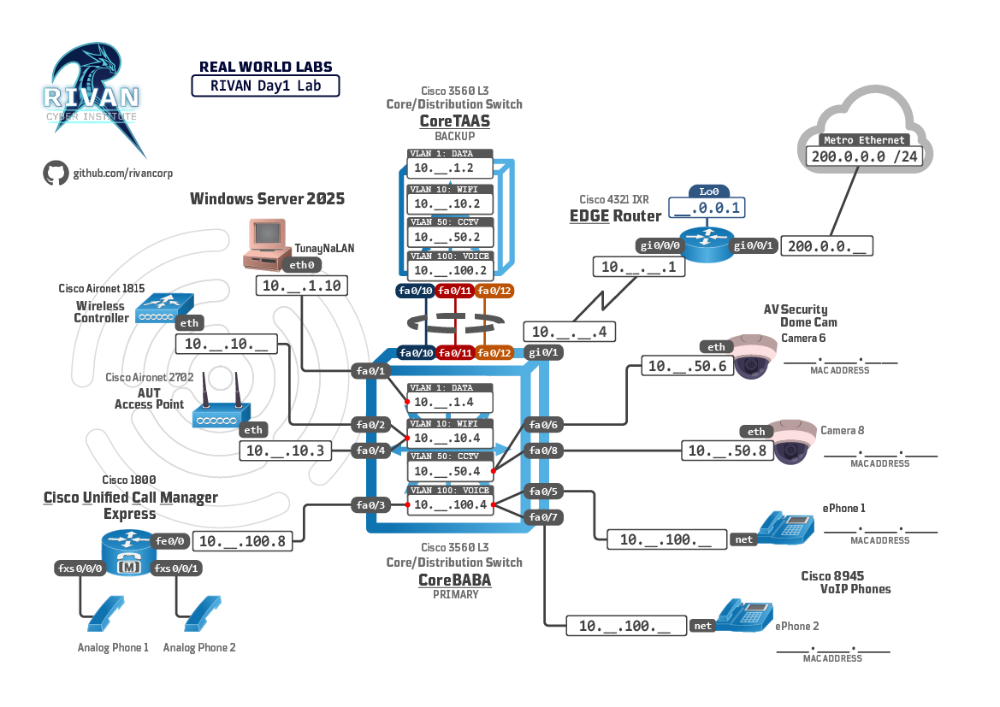
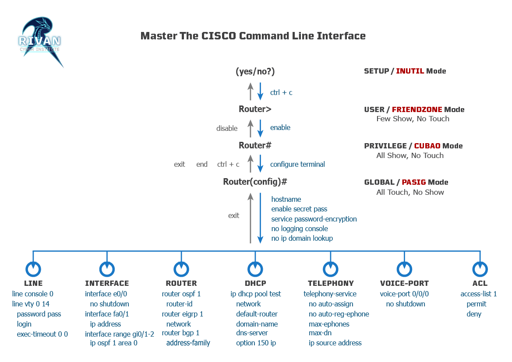
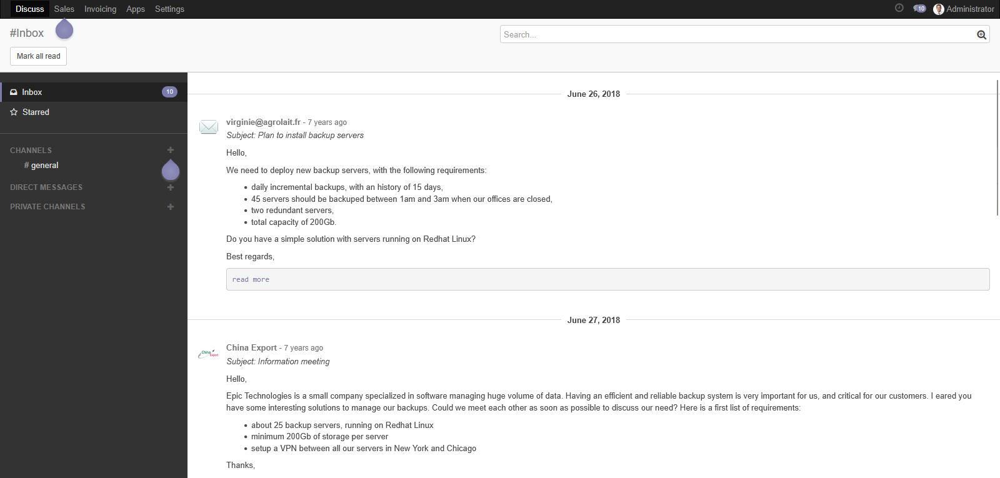
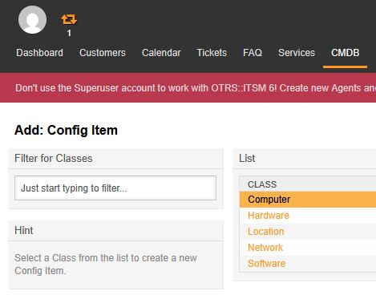

<!-- Your monitor number = #$34T# -->

# 👋 Welcome to Rivan
*"There's no better teacher than experience"*

&nbsp;
## 📋 Prove what you are doing.
 - Create a Github account: https://github.com/

 

Import the repositories.
 - Rivan_Day1 : https://github.com/art-stacks/Rivan_Day1
 - SecPlus701 : https://github.com/rivancorp/SECplus701

 
 

---
&nbsp;

## 📂 Create your own folder in the desktop
~~~
@cmd
cd Desktop
mkdir _name-#$34T#
cd _name-#$34T#
dir
~~~

 
 

---
&nbsp;

# 💻 Build your network. 

 
 

---
&nbsp;

## 🧱 Hierarchical Network Design
  *What is the most important part of a network? __The Core__*

 

Most common kinds of network architectures.
 - 2-tier                 __Cisco Collapsed Campus Core__
 - 3-tier                 __Enterprise Network Design__
 - Spine-leaf             __Data Center Fabric__

 

CORE Layer (__CoreTAAS__ & __CoreBABA__) - High Speed and Availability
  > [!NOTE]
  >*"A Network Engineer MUST avoid a single point of failure.
   __Always have a backup.__"*

 

Examples:
  | __Protocol__                 | __Supported Devices__    |
  | ---                          | ---                      |
  | Etherchannel                 | Cisco Catalyst..and more |
  | FlexStack (Master Switch)    | Cisco 2960 & 6500 Series |
  | VSS (Single logical switch)  | NXOS 9k                  |
  | SSO (Stateful Switchover)
  | NSF (Non-stop Forwarding)

 
 

---
&nbsp;

## 🔌 Wired and wireless network.
*How many devices do you have right now that can connect to the internet?*

 

> [!NOTE]
> A network must be Flexible. Reliable. __AVAILABLE__.

 

### 📶 PLDT AP vs Wireless Controller & Autonomous AP

 

Wifi Mesh
 - Wired Backhaul
 - Wireless Backhaul

 

Wifi standards | [IEEE (Institute of Electrical and Electronics Engineers)](https://standards.ieee.org/beyond-standards/the-evolution-of-wi-fi-technology-and-standards/)

  - WiFi 6     IEEE 802.11ax
  - WiFi 7     IEEE P802.11be

 
 

---
&nbsp;

## 🔍 Implement security solutions.
*What is more valuable than gold? __Data__*

 

Network security infrastructure
 - NGFW, UTM, IDS
 - Security Policies
     - Windows Local Security Policy
 - Surveillance
     - IP Cameras (__CAM6__ & __CAM8__)

 

Made in US 🇺🇸 vs Made in China 🇨🇳

 
 

---
&nbsp;

## 📠 Enterprise Communication
*How often are meetings conducted in your work place?*

 

Cisco Unified Call Manager | [Unified Communications and Collaboration.](https://www.cisco.com/c/en/us/products/unified-communications/index.html)
  - POTS (__Analog__)
  - VOIP (__ePhone__)

 
 

---
&nbsp;

## 🌐 Internet Connectivity
*When to use UTP and Fibre Optic*

 

[IEEE Ethernet Standards](https://www.ccnaacademy.com/2018/09/ieee-ethernet-standards_16.html)

  | Name            | Speed | IEEE  |
  | ---             |  ---  |  ---  |
  | Ethernet        |       |       |
  | FastEthernet    |       |       |
  | GigEthernet     |       |       |
  | TenGigEthernet  |       |       |

 

  - RJ45 Jack
  - SFP (Small Form-factor Pluggable)

 

  | Copper                                           | Single-mode fiber                    |
  | ---                                              | ---                                  |
  | Conductor, Bedding, Sheathing                    | Core, Cladding, Coating              |
  | Affected by electrical and magnetic interference | Comprised of insulated glass strands |

 
 

---
&nbsp;

# 🔧 Access the CLI
*How can you tell if a device is expensive? It has a __Console Port__*

 

Serial Cable
  - VGA, USB
  - Ugreen

 
 

---
&nbsp;

## ⌨️ Master the Command Line Interface (CLI)
*How to know if someone has less than 1 year experience?*

 

 
 

~~~
!@Switch
conf t
 int fa0/1
  exit
 int g0/1
  exit
 line cons 0
  exit
!
!
conf t
 int fa0/1
  shutdown
  no shutdown
  end
~~~

 
 

---
&nbsp;

# 📤 IT Service Management
*If it is not documented, it never existed.*
- ITSM
- CMDB

 

### Lab Setup
__1. Run the *SOC-IR* virtual machine.__  

 

__2. VM Login information:__
> Username: root  
> Password: C1sc0123

 

__3. Get the IP address of the VM.__  
Enter the command inside the VM
~~~bash
@SOC-IR
ip addr
~~~

 

__4. Add a hostname mapping.__  
Access the __hosts__ file located on `c:\Windows\System32\drivers\etc`  
Then, enter add the following mapping to the hosts file:
~~~
rivan.cloudsoc.com  208.8.8.144
~~~

> [!Note]
> __208.8.8.144__ must be your virtual machine IP address.

 

__5. Ping to verify setup for the virtual machine.__
~~~
@cmd
ping rivan.cloudsoc.com
~~~

&nbsp;
---
&nbsp;

## 🔄 ITSM Process | Implementing Cybersecurity best practices
### 👤 Upper Management
http://rivan.cloudsoc.com:8069  
> Username: itil@rivanschool.com  
> Password: C1sc0123

 

&nbsp;
---
&nbsp;

### 🏃 Service Delivery Team
http://rivan.cloudsoc.com/otrs/index.pl  
> Username: root@localhost  
> Password: C1sc0123

 

&nbsp;
---
&nbsp;

### 🙇 Service Desk
http://rivan.cloudsoc.com/otrs/customer.pl  
> Username: user1  
> Password: C1sc0123

 

&nbsp;
---
&nbsp;

## 📦 Operational Support System
*How easy is it to bring home items from your company?*

- AMS (Asset Management System)
- IMS (Inventory Management System)
- CMDB (Configuration Management Databases)

 

### 🎯 Exercise 01: Register Windows Server 2025 to your company's database.

__1. Access CMDB__  
 

 
 

__2. Select the appropriate Item Class__  
 

 
 

__3. Register Windows Server 2025.__  
  
View System specs using __DirectX Diagnostic Tool__  
~~~
@WinServer [Win + R]
dxdiag
~~~

 

Or view __System Information__  
~~~
@WinServer [Win + R]
msinfo32
~~~

 

Identify Serial number
~~~powershell
@powershell
Get-WmiObject win32_bios | select Serialnumber
~~~

 

Example Diagnostic

~~~
------------------
System Information
------------------
      Time of this report: 8/26/2025, 11:32:11
             Machine name: WIN-E9VNF37O0IT
               Machine Id: {3647C9BF-3098-49D9-A5A9-692214778522}
         Operating System: Windows Server 2025 Standard 64-bit (10.0, Build 26100) (26100.ge_release.240331-1435)
                 Language: English (Regional Setting: English)
      System Manufacturer: HP
             System Model: HP Pro Mini 260 G9 Desktop PC
                     BIOS: 02.19.00 (type: UEFI)
                Processor: 12th Gen Intel(R) Core(TM) i5-1235U (12 CPUs), ~1.3GHz
                   Memory: 40960MB RAM
      Available OS Memory: 40632MB RAM
                Page File: 18232MB used, 28287MB available
              Windows Dir: C:\WINDOWS
          DirectX Version: DirectX 12
      DX Setup Parameters: Not found
         User DPI Setting: 96 DPI (100 percent)
       System DPI Setting: 96 DPI (100 percent)
          DWM DPI Scaling: Disabled
                 Miracast: Available, with HDCP
Microsoft Graphics Hybrid: Not Supported
 DirectX Database Version: 1.7.3
   Auto Super Res Version: Unknown
       System Mux Support: Mux Support Inactive - Ok
           Mux Target GPU: dGPU
    Mux Incompatible List: 
           DxDiag Version: 10.00.26100.3912 64bit Unicode

------------
DxDiag Notes
------------
      Display Tab 1: No problems found.
        Sound Tab 1: No problems found.
        Sound Tab 2: No problems found.
          Input Tab: No problems found.

--------------------
DirectX Debug Levels
--------------------
Direct3D:    0/4 (retail)
DirectDraw:  0/4 (retail)
DirectInput: 0/5 (retail)
DirectMusic: 0/5 (retail)
DirectPlay:  0/9 (retail)
DirectSound: 0/5 (retail)
DirectShow:  0/6 (retail)

---------------
Display Devices
---------------
           Card name: Intel(R) Iris(R) Xe Graphics
        Manufacturer: Intel Corporation
           Chip type: Intel(R) Iris(R) Xe Graphics Family
            DAC type: Internal
         Device Type: Full Device (POST)
          Device Key: Enum\PCI\VEN_8086&DEV_46A8&SUBSYS_8956103C&REV_0C
       Device Status: 0180200A [DN_DRIVER_LOADED|DN_STARTED|DN_DISABLEABLE|DN_NT_ENUMERATOR|DN_NT_DRIVER] 
 Device Problem Code: No Problem
 Driver Problem Code: Unknown
      Display Memory: 20443 MB
    Dedicated Memory: 128 MB
       Shared Memory: 20315 MB
        Current Mode: 1600 x 900 (32 bit) (60Hz)
         HDR Support: Supported
    Display Topology: Internal
 Display Color Space: DXGI_COLOR_SPACE_RGB_FULL_G22_NONE_P709
     Color Primaries: Red(0.681641,0.315430), Green(0.272461,0.654297), Blue(0.150391,0.059570), White Point(0.313477,0.329102)
   Display Luminance: Min Luminance = 0.000000, Max Luminance = 400.000000, MaxFullFrameLuminance = 232.749603
        Monitor Name: Generic PnP Monitor
       Monitor Model: IPS0001
          Monitor Id: IPS0001
         Native Mode: 1600 x 900(p) (59.671Hz)
         Output Type: HDMI
Monitor Capabilities: HDR Supported (BT2020RGB BT2020YCC Eotf2084Supported )
Display Pixel Format: DISPLAYCONFIG_PIXELFORMAT_32BPP
      Advanced Color: AdvancedColorSupported 
      Using DDisplay: Yes
                 WCG: Wcg Supported
   Active Color Mode: DISPLAYCONFIG_ADVANCED_COLOR_MODE_SDR
         Driver Name: C:\WINDOWS\System32\DriverStore\FileRepository\iigd_dch.inf_amd64_90ca605626b0a0ef\igdumdim64.dll,C:\WINDOWS\System32\DriverStore\FileRepository\iigd_dch.inf_amd64_90ca605626b0a0ef\igd10iumd64.dll,C:\WINDOWS\System32\DriverStore\FileRepository\iigd_dch.inf_amd64_90ca605626b0a0ef\igd10iumd64.dll,C:\WINDOWS\System32\DriverStore\FileRepository\iigd_dch.inf_amd64_90ca605626b0a0ef\igd12umd64.dll
 Driver File Version: 32.00.0101.5972 (English)
      Driver Version: 32.0.101.5972
         DDI Version: 12
  Adapter Attributes: HARDWARE_TYPE_GPU,D3D11_GRAPHICS,D3D12_GRAPHICS,D3D12_CORE_COMPUTE,D3D12_GENERIC_ML,D3D12_GENERIC_MEDIA
      Feature Levels: 12_1,12_0,11_1,11_0,10_1,10_0,9_3,9_2,9_1,1_0_CORE
        Driver Model: WDDM 3.2
 Hardware Scheduling: DriverSupportState:AlwaysOff Enabled:False 
         Displayable: Supported 
 Graphics Preemption: Triangle
  Compute Preemption: Thread group
            Miracast: Not Supported by Graphics driver
      Detachable GPU: No
 Hybrid Graphics GPU: Integrated
     GPU Mux Support: Experimental, None - Unknown Error
      Power P-states: Not Supported
      Virtualization: Paravirtualization 
          Block List: DISABLE_HWSCH
  Catalog Attributes: Universal:True Declarative:True 
   Driver Attributes: Final Retail
    Driver Date/Size: 8/19/2024 8:00:00 AM, 2656416 bytes
         WHQL Logo'd: Yes
     WHQL Date Stamp: Unknown
   Device Identifier: {D7B78E66-05E8-11CF-D864-33A9A3C2ED35}
           Vendor ID: 0x8086
           Device ID: 0x46A8
           SubSys ID: 0x8956103C
         Revision ID: 0x000C
  Driver Strong Name: oem55.inf:5f63e5343e93bab4:iADLPD_w10_DS:32.0.101.5972:PCI\VEN_8086&DEV_46A8&SUBSYS_8956103C
      Rank Of Driver: 00CF0001
         Video Accel: ModeMPEG2_A ModeMPEG2_C ModeWMV9_C ModeVC1_C 
         DXVA2 Modes: DXVA2_ModeMPEG2_VLD  DXVA2_ModeMPEG2_IDCT  DXVA2_ModeVC1_D2010  {E07EC519-E651-4CD6-AC84-1370CCEEC851}  {BCC5DB6D-A2B6-4AF0-ACE4-ADB1F787BC89}  DXVA2_ModeWMV9_IDCT  DXVA2_ModeVC1_IDCT  DXVA2_ModeH264_VLD_NoFGT  DXVA2_ModeH264_VLD_Stereo_Progressive_NoFGT  DXVA2_ModeH264_VLD_Stereo_NoFGT  DXVA2_ModeH264_VLD_Multiview_NoFGT  {C528916C-C0AF-4645-8CB2-372B6D4ADC2A}  {91CD2D6E-897B-4FA1-B0D7-51DC88010E0A}  {97688186-56A8-4094-B543-FC9DAAA49F4B}  {1424D4DC-7CF5-4BB1-9CD7-B63717A72A6B}  {C346E8A3-CBED-4D27-87CC-A70EB4DC8C27}  {FFC79924-5EAF-4666-A736-06190F281443}  {464BDB3C-91C4-4E9B-896F-225496AC4ED6}  {9B31316B-F204-455D-8A8C-9345DCA77C01}  {AFE4285C-AB63-4B2D-8278-E6BAACEA2CE9}  {277DE9C5-ED83-48DD-AB8F-AC2D24B22943}  {04C5BA10-4E9A-4B8E-8DBF-4F4B48AFA27C}  {0ACEF8BC-285F-415D-AB22-7BF2527A3D2E}  {24D19FCA-C5A2-4B8E-9F93-F8F6EF15C890}  {353ACA91-D945-4C13-AE7E-469060FAC8D8}  {28566328-F041-4466-8B14-8F5831E78F8B}  {6B4A94DB-54FE-4AE1-9BE4-7A7DAD004600}  {B8B28E0C-ECAB-4217-8C82-EAAA9755AAF0}  {8732ECFD-9747-4897-B42A-E534F9FF2B7A}  {E139B5CA-47B2-40E1-AF1C-AD71A67A1836}  {056A6E36-F3A8-4D00-9663-7E9430358BF9}  {5415A68C-231E-46F4-878B-5E9A22E967E9}  {161BE912-44C2-49C0-B61E-D946852B32A1}  {D6D6BC4F-D51A-4712-97E8-750917C860FD}  {7FEF652D-3233-44DF-ACF7-ECFB584DAB35}  {87B2AE39-C9A5-4C53-86B8-A52D7EDBA488}  {10E19AC8-BF39-4443-BEC3-1B0CBFE4C7AA}  {2DEC00C7-21EE-4BF8-8F0E-773F11F126A2}  {C35153A0-23C0-4A81-B3BB-6A1326F2B76B}  {A33FD0EC-A9D3-4C21-9276-C241CC90F6C7}  {310E59D2-7EA4-47BB-B319-500E78855336}  {036DFF40-94A6-45B3-A0B3-71F0CDF35129}  {8C56EB1E-2B47-466F-8D33-7DBCD63F3DF2}  DXVA2_ModeHEVC_VLD_Main  {75FC75F7-C589-4A07-A25B-72E03B0383B3}  DXVA2_ModeHEVC_VLD_Main10  {9CC55490-E37C-4932-8684-4920F9F6409C}  {0BAC4FE5-1532-4429-A854-F84DE04953DB}  {4008018F-F537-4B36-98CF-61AF8A2C1A33}  {0DABEFFA-4458-4602-BC03-0795659D617C}  {1A72925F-0C2C-4F15-96FB-B17D1473603F}  {55BCAC81-F311-4093-A7D0-1CBC0B849BEE}  {9798634D-FE9D-48E5-B4DA-DBEC45B3DF01}  {E484DCB8-CAC9-4859-99F5-5C0D45069089}  {41A5AF96-E415-4B0C-9D03-907858E23E78}  {6A6A81BA-912A-485D-B57F-CCD2D37B8D94}  {E4E3CF5B-97D2-4658-AACB-366E3EE2CEEE}  {FD9D9559-0FD3-4917-A9A7-07E714EE9EF9}  {0E4BC693-5D2C-4936-B125-AEFE32B16D8A}  {2F08B5B1-DBC2-4D48-883A-4E7B8174CFF6}  {5467807A-295D-445D-BD2E-CBA8C2457C3D}  {AE0D4E15-2360-40A8-BF82-028E6A0DD827}  {8FF8A3AA-C456-4132-B6EF-69D9DD72571D}  {C23DD857-874B-423C-B6E0-82CEAA9B118A}  {5B08E35D-0C66-4C51-A6F1-89D00CB2C197}  {07CFAFFB-5A2E-4B99-B62A-E4CA53B6D5AA}  DXVA2_ModeVP9_VLD_Profile0  DXVA2_ModeVP9_VLD_10bit_Profile2  {76988A52-DF13-419A-8E64-FFCF4A336CF5}  {68A21C7B-D58F-4E74-9993-E4B8172B19A0}  {80A3A7BD-89D8-4497-A2B8-2126AF7E6EB8}  {1D5C4D76-B55A-4430-904C-3383A7AE3B16}  {A7F759DD-5F54-4D7F-8291-42E883C546FE}  {F34FA92F-DC79-474C-B0DB-B7BD4522DF77}  {B8BE4CCB-CF53-46BA-8D59-D6B8A6DA5D2A}  {CA44AFC5-E1D0-42E6-9154-B127186D4D40}  {F9A16190-3FB4-4DC5-9846-C8751F83D6D7}  {50925B7B-E931-4978-A12A-586630F095F9}  {B69C20E0-2508-8790-0305-875499E0A2D0}  {49761BEC-4B63-4349-A5FF-87FFDF088466}  
         D3D12 Encode Modes: { D3D12_VIDEO_ENCODER_PROFILE_H264_MAIN } { D3D12_VIDEO_ENCODER_PROFILE_H264_HIGH } { D3D12_VIDEO_ENCODER_PROFILE_HEVC_MAIN }{ D3D12_VIDEO_ENCODER_PROFILE_HEVC_MAIN10 }
    Deinterlace Caps: {BF752EF6-8CC4-457A-BE1B-08BD1CAEEE9F}: Format(In/Out)=(YUY2,YUY2) Frames(Prev/Fwd/Back)=(0,0,1) Caps=VideoProcess_YUV2RGB VideoProcess_StretchX VideoProcess_StretchY VideoProcess_AlphaBlend DeinterlaceTech_EdgeFiltering 
                      {335AA36E-7884-43A4-9C91-7F87FAF3E37E}: Format(In/Out)=(YUY2,YUY2) Frames(Prev/Fwd/Back)=(0,0,0) Caps=VideoProcess_YUV2RGB VideoProcess_StretchX VideoProcess_StretchY VideoProcess_AlphaBlend DeinterlaceTech_BOBVerticalStretch 
                      {5A54A0C9-C7EC-4BD9-8EDE-F3C75DC4393B}: Format(In/Out)=(YUY2,YUY2) Frames(Prev/Fwd/Back)=(0,0,0) Caps=VideoProcess_YUV2RGB VideoProcess_StretchX VideoProcess_StretchY VideoProcess_AlphaBlend 
                      {BF752EF6-8CC4-457A-BE1B-08BD1CAEEE9F}: Format(In/Out)=(UYVY,YUY2) Frames(Prev/Fwd/Back)=(0,0,1) Caps=VideoProcess_YUV2RGB VideoProcess_StretchX VideoProcess_StretchY VideoProcess_AlphaBlend DeinterlaceTech_EdgeFiltering 
                      {335AA36E-7884-43A4-9C91-7F87FAF3E37E}: Format(In/Out)=(UYVY,YUY2) Frames(Prev/Fwd/Back)=(0,0,0) Caps=VideoProcess_YUV2RGB VideoProcess_StretchX VideoProcess_StretchY VideoProcess_AlphaBlend DeinterlaceTech_BOBVerticalStretch 
                      {5A54A0C9-C7EC-4BD9-8EDE-F3C75DC4393B}: Format(In/Out)=(UYVY,YUY2) Frames(Prev/Fwd/Back)=(0,0,0) Caps=VideoProcess_YUV2RGB VideoProcess_StretchX VideoProcess_StretchY VideoProcess_AlphaBlend 
                      {BF752EF6-8CC4-457A-BE1B-08BD1CAEEE9F}: Format(In/Out)=(YV12,YUY2) Frames(Prev/Fwd/Back)=(0,0,1) Caps=VideoProcess_YUV2RGB VideoProcess_StretchX VideoProcess_StretchY VideoProcess_AlphaBlend DeinterlaceTech_EdgeFiltering 
                      {335AA36E-7884-43A4-9C91-7F87FAF3E37E}: Format(In/Out)=(YV12,YUY2) Frames(Prev/Fwd/Back)=(0,0,0) Caps=VideoProcess_YUV2RGB VideoProcess_StretchX VideoProcess_StretchY VideoProcess_AlphaBlend DeinterlaceTech_BOBVerticalStretch 
                      {5A54A0C9-C7EC-4BD9-8EDE-F3C75DC4393B}: Format(In/Out)=(YV12,YUY2) Frames(Prev/Fwd/Back)=(0,0,0) Caps=VideoProcess_YUV2RGB VideoProcess_StretchX VideoProcess_StretchY VideoProcess_AlphaBlend 
                      {BF752EF6-8CC4-457A-BE1B-08BD1CAEEE9F}: Format(In/Out)=(NV12,YUY2) Frames(Prev/Fwd/Back)=(0,0,1) Caps=VideoProcess_YUV2RGB VideoProcess_StretchX VideoProcess_StretchY VideoProcess_AlphaBlend DeinterlaceTech_EdgeFiltering 
                      {335AA36E-7884-43A4-9C91-7F87FAF3E37E}: Format(In/Out)=(NV12,YUY2) Frames(Prev/Fwd/Back)=(0,0,0) Caps=VideoProcess_YUV2RGB VideoProcess_StretchX VideoProcess_StretchY VideoProcess_AlphaBlend DeinterlaceTech_BOBVerticalStretch 
                      {5A54A0C9-C7EC-4BD9-8EDE-F3C75DC4393B}: Format(In/Out)=(NV12,YUY2) Frames(Prev/Fwd/Back)=(0,0,0) Caps=VideoProcess_YUV2RGB VideoProcess_StretchX VideoProcess_StretchY VideoProcess_AlphaBlend 
                      {BF752EF6-8CC4-457A-BE1B-08BD1CAEEE9F}: Format(In/Out)=(IMC1,YUY2) Frames(Prev/Fwd/Back)=(0,0,1) Caps=VideoProcess_YUV2RGB VideoProcess_StretchX VideoProcess_StretchY VideoProcess_AlphaBlend DeinterlaceTech_EdgeFiltering 
                      {335AA36E-7884-43A4-9C91-7F87FAF3E37E}: Format(In/Out)=(IMC1,YUY2) Frames(Prev/Fwd/Back)=(0,0,0) Caps=VideoProcess_YUV2RGB VideoProcess_StretchX VideoProcess_StretchY VideoProcess_AlphaBlend DeinterlaceTech_BOBVerticalStretch 
                      {5A54A0C9-C7EC-4BD9-8EDE-F3C75DC4393B}: Format(In/Out)=(IMC1,YUY2) Frames(Prev/Fwd/Back)=(0,0,0) Caps=VideoProcess_YUV2RGB VideoProcess_StretchX VideoProcess_StretchY VideoProcess_AlphaBlend 
                      {BF752EF6-8CC4-457A-BE1B-08BD1CAEEE9F}: Format(In/Out)=(IMC2,YUY2) Frames(Prev/Fwd/Back)=(0,0,1) Caps=VideoProcess_YUV2RGB VideoProcess_StretchX VideoProcess_StretchY VideoProcess_AlphaBlend DeinterlaceTech_EdgeFiltering 
                      {335AA36E-7884-43A4-9C91-7F87FAF3E37E}: Format(In/Out)=(IMC2,YUY2) Frames(Prev/Fwd/Back)=(0,0,0) Caps=VideoProcess_YUV2RGB VideoProcess_StretchX VideoProcess_StretchY VideoProcess_AlphaBlend DeinterlaceTech_BOBVerticalStretch 
                      {5A54A0C9-C7EC-4BD9-8EDE-F3C75DC4393B}: Format(In/Out)=(IMC2,YUY2) Frames(Prev/Fwd/Back)=(0,0,0) Caps=VideoProcess_YUV2RGB VideoProcess_StretchX VideoProcess_StretchY VideoProcess_AlphaBlend 
                      {BF752EF6-8CC4-457A-BE1B-08BD1CAEEE9F}: Format(In/Out)=(IMC3,YUY2) Frames(Prev/Fwd/Back)=(0,0,1) Caps=VideoProcess_YUV2RGB VideoProcess_StretchX VideoProcess_StretchY VideoProcess_AlphaBlend DeinterlaceTech_EdgeFiltering 
                      {335AA36E-7884-43A4-9C91-7F87FAF3E37E}: Format(In/Out)=(IMC3,YUY2) Frames(Prev/Fwd/Back)=(0,0,0) Caps=VideoProcess_YUV2RGB VideoProcess_StretchX VideoProcess_StretchY VideoProcess_AlphaBlend DeinterlaceTech_BOBVerticalStretch 
                      {5A54A0C9-C7EC-4BD9-8EDE-F3C75DC4393B}: Format(In/Out)=(IMC3,YUY2) Frames(Prev/Fwd/Back)=(0,0,0) Caps=VideoProcess_YUV2RGB VideoProcess_StretchX VideoProcess_StretchY VideoProcess_AlphaBlend 
                      {BF752EF6-8CC4-457A-BE1B-08BD1CAEEE9F}: Format(In/Out)=(IMC4,YUY2) Frames(Prev/Fwd/Back)=(0,0,1) Caps=VideoProcess_YUV2RGB VideoProcess_StretchX VideoProcess_StretchY VideoProcess_AlphaBlend DeinterlaceTech_EdgeFiltering 
                      {335AA36E-7884-43A4-9C91-7F87FAF3E37E}: Format(In/Out)=(IMC4,YUY2) Frames(Prev/Fwd/Back)=(0,0,0) Caps=VideoProcess_YUV2RGB VideoProcess_StretchX VideoProcess_StretchY VideoProcess_AlphaBlend DeinterlaceTech_BOBVerticalStretch 
                      {5A54A0C9-C7EC-4BD9-8EDE-F3C75DC4393B}: Format(In/Out)=(IMC4,YUY2) Frames(Prev/Fwd/Back)=(0,0,0) Caps=VideoProcess_YUV2RGB VideoProcess_StretchX VideoProcess_StretchY VideoProcess_AlphaBlend 
                      {00000000-0000-0000-0000-000000000000}: Format(In/Out)=(S340,YUY2) Frames(Prev/Fwd/Back)=(0,0,0) Caps=
                      {00000000-0000-0000-0000-000000000000}: Format(In/Out)=(S340,YUY2) Frames(Prev/Fwd/Back)=(0,0,0) Caps=
                      {00000000-0000-0000-0000-000000000000}: Format(In/Out)=(S340,YUY2) Frames(Prev/Fwd/Back)=(0,0,0) Caps=
                      {00000000-0000-0000-0000-000000000000}: Format(In/Out)=(S340,YUY2) Frames(Prev/Fwd/Back)=(0,0,0) Caps=
                      {00000000-0000-0000-0000-000000000000}: Format(In/Out)=(S340,YUY2) Frames(Prev/Fwd/Back)=(0,0,0) Caps=
                      {00000000-0000-0000-0000-000000000000}: Format(In/Out)=(S340,YUY2) Frames(Prev/Fwd/Back)=(0,0,0) Caps=
                      {00000000-0000-0000-0000-000000000000}: Format(In/Out)=(S340,YUY2) Frames(Prev/Fwd/Back)=(0,0,0) Caps=
                      {00000000-0000-0000-0000-000000000000}: Format(In/Out)=(S340,YUY2) Frames(Prev/Fwd/Back)=(0,0,0) Caps=
                      {00000000-0000-0000-0000-000000000000}: Format(In/Out)=(S340,YUY2) Frames(Prev/Fwd/Back)=(0,0,0) Caps=
                      {00000000-0000-0000-0000-000000000000}: Format(In/Out)=(S340,YUY2) Frames(Prev/Fwd/Back)=(0,0,0) Caps=
                      {00000000-0000-0000-0000-000000000000}: Format(In/Out)=(S340,YUY2) Frames(Prev/Fwd/Back)=(0,0,0) Caps=
                      {00000000-0000-0000-0000-000000000000}: Format(In/Out)=(S340,YUY2) Frames(Prev/Fwd/Back)=(0,0,0) Caps=
                      {00000000-0000-0000-0000-000000000000}: Format(In/Out)=(S340,YUY2) Frames(Prev/Fwd/Back)=(0,0,0) Caps=
                      {00000000-0000-0000-0000-000000000000}: Format(In/Out)=(S340,YUY2) Frames(Prev/Fwd/Back)=(0,0,0) Caps=
                      {00000000-0000-0000-0000-000000000000}: Format(In/Out)=(S340,YUY2) Frames(Prev/Fwd/Back)=(0,0,0) Caps=
                      {00000000-0000-0000-0000-000000000000}: Format(In/Out)=(S340,YUY2) Frames(Prev/Fwd/Back)=(0,0,0) Caps=
                      {00000000-0000-0000-0000-000000000000}: Format(In/Out)=(S340,YUY2) Frames(Prev/Fwd/Back)=(0,0,0) Caps=
                      {00000000-0000-0000-0000-000000000000}: Format(In/Out)=(S340,YUY2) Frames(Prev/Fwd/Back)=(0,0,0) Caps=
                      {00000000-0000-0000-0000-000000000000}: Format(In/Out)=(S340,YUY2) Frames(Prev/Fwd/Back)=(0,0,0) Caps=
                      {00000000-0000-0000-0000-000000000000}: Format(In/Out)=(S340,YUY2) Frames(Prev/Fwd/Back)=(0,0,0) Caps=
                      {00000000-0000-0000-0000-000000000000}: Format(In/Out)=(S340,YUY2) Frames(Prev/Fwd/Back)=(0,0,0) Caps=
                      {00000000-0000-0000-0000-000000000000}: Format(In/Out)=(S340,YUY2) Frames(Prev/Fwd/Back)=(0,0,0) Caps=
                      {00000000-0000-0000-0000-000000000000}: Format(In/Out)=(S340,YUY2) Frames(Prev/Fwd/Back)=(0,0,0) Caps=
                      {00000000-0000-0000-0000-000000000000}: Format(In/Out)=(S340,YUY2) Frames(Prev/Fwd/Back)=(0,0,0) Caps=
                      {00000000-0000-0000-0000-000000000000}: Format(In/Out)=(S340,YUY2) Frames(Prev/Fwd/Back)=(0,0,0) Caps=
                      {00000000-0000-0000-0000-000000000000}: Format(In/Out)=(S340,YUY2) Frames(Prev/Fwd/Back)=(0,0,0) Caps=
                      {00000000-0000-0000-0000-000000000000}: Format(In/Out)=(S340,YUY2) Frames(Prev/Fwd/Back)=(0,0,0) Caps=
                      {00000000-0000-0000-0000-000000000000}: Format(In/Out)=(S340,YUY2) Frames(Prev/Fwd/Back)=(0,0,0) Caps=
                      {00000000-0000-0000-0000-000000000000}: Format(In/Out)=(S340,YUY2) Frames(Prev/Fwd/Back)=(0,0,0) Caps=
                      {00000000-0000-0000-0000-000000000000}: Format(In/Out)=(S340,YUY2) Frames(Prev/Fwd/Back)=(0,0,0) Caps=
                      {00000000-0000-0000-0000-000000000000}: Format(In/Out)=(S340,YUY2) Frames(Prev/Fwd/Back)=(0,0,0) Caps=
                      {00000000-0000-0000-0000-000000000000}: Format(In/Out)=(S340,YUY2) Frames(Prev/Fwd/Back)=(0,0,0) Caps=
                      {00000000-0000-0000-0000-000000000000}: Format(In/Out)=(S342,YUY2) Frames(Prev/Fwd/Back)=(0,0,0) Caps=
                      {00000000-0000-0000-0000-000000000000}: Format(In/Out)=(S342,YUY2) Frames(Prev/Fwd/Back)=(0,0,0) Caps=
                      {00000000-0000-0000-0000-000000000000}: Format(In/Out)=(S342,YUY2) Frames(Prev/Fwd/Back)=(0,0,0) Caps=
                      {00000000-0000-0000-0000-000000000000}: Format(In/Out)=(S342,YUY2) Frames(Prev/Fwd/Back)=(0,0,0) Caps=
                      {00000000-0000-0000-0000-000000000000}: Format(In/Out)=(S342,YUY2) Frames(Prev/Fwd/Back)=(0,0,0) Caps=
                      {00000000-0000-0000-0000-000000000000}: Format(In/Out)=(S342,YUY2) Frames(Prev/Fwd/Back)=(0,0,0) Caps=
                      {00000000-0000-0000-0000-000000000000}: Format(In/Out)=(S342,YUY2) Frames(Prev/Fwd/Back)=(0,0,0) Caps=
                      {00000000-0000-0000-0000-000000000000}: Format(In/Out)=(S342,YUY2) Frames(Prev/Fwd/Back)=(0,0,0) Caps=
                      {00000000-0000-0000-0000-000000000000}: Format(In/Out)=(S342,YUY2) Frames(Prev/Fwd/Back)=(0,0,0) Caps=
                      {00000000-0000-0000-0000-000000000000}: Format(In/Out)=(S342,YUY2) Frames(Prev/Fwd/Back)=(0,0,0) Caps=
                      {00000000-0000-0000-0000-000000000000}: Format(In/Out)=(S342,YUY2) Frames(Prev/Fwd/Back)=(0,0,0) Caps=
                      {00000000-0000-0000-0000-000000000000}: Format(In/Out)=(S342,YUY2) Frames(Prev/Fwd/Back)=(0,0,0) Caps=
                      {00000000-0000-0000-0000-000000000000}: Format(In/Out)=(S342,YUY2) Frames(Prev/Fwd/Back)=(0,0,0) Caps=
                      {00000000-0000-0000-0000-000000000000}: Format(In/Out)=(S342,YUY2) Frames(Prev/Fwd/Back)=(0,0,0) Caps=
                      {00000000-0000-0000-0000-000000000000}: Format(In/Out)=(S342,YUY2) Frames(Prev/Fwd/Back)=(0,0,0) Caps=
                      {00000000-0000-0000-0000-000000000000}: Format(In/Out)=(S342,YUY2) Frames(Prev/Fwd/Back)=(0,0,0) Caps=
                      {00000000-0000-0000-0000-000000000000}: Format(In/Out)=(S342,YUY2) Frames(Prev/Fwd/Back)=(0,0,0) Caps=
                      {00000000-0000-0000-0000-000000000000}: Format(In/Out)=(S342,YUY2) Frames(Prev/Fwd/Back)=(0,0,0) Caps=
                      {00000000-0000-0000-0000-000000000000}: Format(In/Out)=(S342,YUY2) Frames(Prev/Fwd/Back)=(0,0,0) Caps=
                      {00000000-0000-0000-0000-000000000000}: Format(In/Out)=(S342,YUY2) Frames(Prev/Fwd/Back)=(0,0,0) Caps=
                      {00000000-0000-0000-0000-000000000000}: Format(In/Out)=(S342,YUY2) Frames(Prev/Fwd/Back)=(0,0,0) Caps=
                      {00000000-0000-0000-0000-000000000000}: Format(In/Out)=(S342,YUY2) Frames(Prev/Fwd/Back)=(0,0,0) Caps=
                      {00000000-0000-0000-0000-000000000000}: Format(In/Out)=(S342,YUY2) Frames(Prev/Fwd/Back)=(0,0,0) Caps=
                      {00000000-0000-0000-0000-000000000000}: Format(In/Out)=(S342,YUY2) Frames(Prev/Fwd/Back)=(0,0,0) Caps=
                      {00000000-0000-0000-0000-000000000000}: Format(In/Out)=(S342,YUY2) Frames(Prev/Fwd/Back)=(0,0,0) Caps=
                      {00000000-0000-0000-0000-000000000000}: Format(In/Out)=(S342,YUY2) Frames(Prev/Fwd/Back)=(0,0,0) Caps=
                      {00000000-0000-0000-0000-000000000000}: Format(In/Out)=(S342,YUY2) Frames(Prev/Fwd/Back)=(0,0,0) Caps=
                      {00000000-0000-0000-0000-000000000000}: Format(In/Out)=(S342,YUY2) Frames(Prev/Fwd/Back)=(0,0,0) Caps=
                      {00000000-0000-0000-0000-000000000000}: Format(In/Out)=(S342,YUY2) Frames(Prev/Fwd/Back)=(0,0,0) Caps=
                      {00000000-0000-0000-0000-000000000000}: Format(In/Out)=(S342,YUY2) Frames(Prev/Fwd/Back)=(0,0,0) Caps=
                      {00000000-0000-0000-0000-000000000000}: Format(In/Out)=(S342,YUY2) Frames(Prev/Fwd/Back)=(0,0,0) Caps=
                      {00000000-0000-0000-0000-000000000000}: Format(In/Out)=(S342,YUY2) Frames(Prev/Fwd/Back)=(0,0,0) Caps=
        D3D9 Overlay: Not Supported
             DXVA-HD: Supported
        DDraw Status: Enabled
          D3D Status: Enabled
          AGP Status: Enabled
       MPO MaxPlanes: 3
            MPO Caps: ROTATION,HORIZONTAL_FLIP,RGB,YUV,BILINEAR,HIGH_FILTER,STRETCH_YUV,STRETCH_RGB,IMMEDIATE,HDR (MPO3)
         MPO Stretch: 21.000X - 0.334X
     MPO Media Hints: colorspace Conversion 
         MPO Formats: NV12
                          YCBCR_STUDIO_G22_LEFT_P601
                          YCBCR_FULL_G22_LEFT_P601
                          YCBCR_STUDIO_G22_LEFT_P709
                          YCBCR_FULL_G22_LEFT_P709
                      YUY2
                          YCBCR_STUDIO_G22_LEFT_P601
                          YCBCR_FULL_G22_LEFT_P601
                          YCBCR_STUDIO_G22_LEFT_P709
                          YCBCR_FULL_G22_LEFT_P709
                      R16G16B16A16_FLOAT
                          RGB_FULL_G10_NONE_P709
                      R10G10B10A2_UNORM
                          RGB_FULL_G22_NONE_P709
                          RGB_STUDIO_G22_NONE_P709
                      R8G8B8A8_UNORM
                          RGB_FULL_G22_NONE_P709
                          RGB_STUDIO_G22_NONE_P709
                      B8G8R8A8_UNORM
                          RGB_FULL_G22_NONE_P709
                          RGB_STUDIO_G22_NONE_P709
    PanelFitter Caps: ROTATION,HORIZONTAL_FLIP,RGB,YUV,BILINEAR,HIGH_FILTER,STRETCH_YUV,STRETCH_RGB,IMMEDIATE,HDR (MPO3)
 PanelFitter Stretch: 21.000X - 0.334X
   Extension Drivers: 
             Driver Name: C:\WINDOWS\System32\DriverStore\FileRepository\iigd_ext.inf_amd64_0e555b581dcafe15\iigd_ext.inf
          Driver Version: 32.0.101.5972
             Driver Date: 08/19/2024
         Driver Provider: Intel Corporation
      Catalog Attributes: Universal:True Declarative:True 
   Component Drivers: 
             Driver Name: Unknown
          Driver Version: Unknown
             Driver Date: Unknown
         Driver Provider: Unknown
      Catalog Attributes: N/A

-------------
MCDM Devices
-------------
-------------
Sound Devices
-------------
            Description: IPS0001 (HD Audio Driver for Display Audio)
 Default Sound Playback: No
 Default Voice Playback: Yes
            Hardware ID: HDAUDIO\SUBFUNC_01&VEN_8086&DEV_281C&NID_0001&SUBSYS_00000000&REV_1000
        Manufacturer ID: N/A
             Product ID: N/A
                   Type: N/A
            Driver Name: AcxHdAudio.sys
         Driver Version: 32.0.101.5972 (English)
      Driver Attributes: Final Retail
            WHQL Logo'd: Yes
          Date and Size: 8/19/2024 8:00:00 AM, 581632 bytes
            Other Files: 
        Driver Provider: Intel Corporation
         HW Accel Level: Emulation Only
              Cap Flags: 0xF1F
    Min/Max Sample Rate: 100, 200000
Static/Strm HW Mix Bufs: 1, 0
 Static/Strm HW 3D Bufs: 0, 0
              HW Memory: 0
       Voice Management: No
 EAX(tm) 2.0 Listen/Src: No, No
   I3DL2(tm) Listen/Src: No, No
Sensaura(tm) ZoomFX(tm): No

            Description: Speakers (Realtek(R) Audio)
 Default Sound Playback: Yes
 Default Voice Playback: No
            Hardware ID: HDAUDIO\FUNC_01&VEN_10EC&DEV_0256&SUBSYS_103C8956&REV_1000
        Manufacturer ID: N/A
             Product ID: N/A
                   Type: N/A
            Driver Name: RTKVHD64.sys
         Driver Version: 6.0.9652.1 (English)
      Driver Attributes: Final Retail
            WHQL Logo'd: Yes
          Date and Size: 3/5/2024 8:00:00 AM, 6142920 bytes
            Other Files: 
        Driver Provider: Realtek Semiconductor Corp.
         HW Accel Level: Emulation Only
              Cap Flags: 0xF1F
    Min/Max Sample Rate: 100, 200000
Static/Strm HW Mix Bufs: 1, 0
 Static/Strm HW 3D Bufs: 0, 0
              HW Memory: 0
       Voice Management: No
 EAX(tm) 2.0 Listen/Src: No, No
   I3DL2(tm) Listen/Src: No, No
Sensaura(tm) ZoomFX(tm): No

---------------------
Sound Capture Devices
---------------------
---------------------
Video Capture Devices
Number of Devices: 1
---------------------
           FriendlyName: OBS Virtual Camera (Windows Virtual Camera)
               Category: Camera
           SymbolicLink: \\?\swd#vcamdevapi#fc8935de480a281600f6cc369ab52757585129199d7200688cbce1109c216c03#{40568484-56a9-4865-b6cc-7a39f7d02837}\{fcebba03-9d13-4c13-9940-cc84fcd132d1}
               Location: n/a
               Rotation: n/a
      SensorOrientation: 0
           Manufacturer: Microsoft
             HardwareID: VCAMDEVAPI\VCAMERA
             DriverDesc: Generic software device
         DriverProvider: Microsoft
          DriverVersion: 10.0.26100.1
      DriverDateEnglish: 6/21/2006 00:00:00
    DriverDateLocalized: 6/21/2006 12:00:00 AM
                Service: n/a
                  Class: SoftwareDevice
          DevNodeStatus: 4180200A[DN_DRIVER_LOADED|DN_STARTED|DN_DISABLEABLE|DN_NT_ENUMERATOR|DN_NT_DRIVER|DN_NO_SHOW_IN_DM]
            ContainerId: {00000000-0000-0000-FFFF-FFFFFFFFFFFF}
            ProblemCode: No Problem
  BusReportedDeviceDesc: Windows Virtual Camera Device
                 Parent: HTREE\ROOT\0
      DriverProblemDesc: n/a
           UpperFilters: n/a
           LowerFilters: n/a
                  Stack: \Driver\SoftwareDevice
      ContainerCategory: n/a
          SensorGroupID: n/a
                   MFT0: n/a
                   DMFT: n/a
    CustomCaptureSource: {E5291486-4C96-497D-A5CD-8533684E1A7D}
  DependentStillCapture: n/a
     EnablePlatformDMFT: n/a
              DMFTChain: n/a
 EnableDshowRedirection: n/a
     FrameServerEnabled: n/a
             MEPOptedIn: n/a
             MEPVersion: n/a
         MEPHighResMode: n/a
        AnalogProviders: n/a
        CompanionAppPfn: n/a
         MSXUCapability: n/a
            Fingerprint: 10.0.26100.1;01C694C5A38C8000;1;0;0;0000000000000000;0000000000000000;
        DMFTVersionInfo: n/a
             ProfileIDs: n/a

-------------------
DirectInput Devices
-------------------
      Device Name: Mouse
         Attached: 1
    Controller ID: n/a
Vendor/Product ID: n/a
        FF Driver: n/a

      Device Name: Keyboard
         Attached: 1
    Controller ID: n/a
Vendor/Product ID: n/a
        FF Driver: n/a

      Device Name: Intel(R) HID Event Filter
         Attached: 1
    Controller ID: 0x0
Vendor/Product ID: 0x8087, 0x0A1E
        FF Driver: n/a

      Device Name: USB Keyboard
         Attached: 1
    Controller ID: 0x0
Vendor/Product ID: 0x1C4F, 0x0026
        FF Driver: n/a

      Device Name: USB Keyboard
         Attached: 1
    Controller ID: 0x0
Vendor/Product ID: 0x1C4F, 0x0026
        FF Driver: n/a

      Device Name: Intel(R) HID Event Filter
         Attached: 1
    Controller ID: 0x0
Vendor/Product ID: 0x8087, 0x0A1E
        FF Driver: n/a

      Device Name: Intel(R) HID Event Filter
         Attached: 1
    Controller ID: 0x0
Vendor/Product ID: 0x8087, 0x0A1E
        FF Driver: n/a

      Device Name: Intel(R) HID Event Filter
         Attached: 1
    Controller ID: 0x0
Vendor/Product ID: 0x8087, 0x0A1E
        FF Driver: n/a

      Device Name: Intel(R) HID Event Filter
         Attached: 1
    Controller ID: 0x0
Vendor/Product ID: 0x8087, 0x0A1E
        FF Driver: n/a

      Device Name: Intel(R) HID Event Filter
         Attached: 1
    Controller ID: 0x0
Vendor/Product ID: 0x8087, 0x0A1E
        FF Driver: n/a

      Device Name: Intel(R) HID Event Filter
         Attached: 1
    Controller ID: 0x0
Vendor/Product ID: 0x8087, 0x0A1E
        FF Driver: n/a

      Device Name: Intel(R) HID Event Filter
         Attached: 1
    Controller ID: 0x0
Vendor/Product ID: 0x8087, 0x0A1E
        FF Driver: n/a

      Device Name: Intel(R) HID Event Filter
         Attached: 1
    Controller ID: 0x0
Vendor/Product ID: 0x8087, 0x0A1E
        FF Driver: n/a

Poll w/ Interrupt: No

-----------
USB Devices
-----------
+ USB Root Hub (USB 3.0)
| Vendor/Product ID: 0x8086, 0x51ED
| Matching Device ID: USB\ROOT_HUB30
| Service: USBHUB3
| Driver: USBHUB3.SYS, 5/23/2025 21:01:51, 742856 bytes
| 
+-+ USB Input Device
| | Vendor/Product ID: 0x09DA, 0x8736
| | Location: Port_#0009.Hub_#0001
| | Matching Device ID: USB\Class_03&SubClass_01
| | Service: HidUsb
| | Driver: hidusb.sys, 5/23/2025 21:01:51, 81920 bytes
| | Driver: hidclass.sys, 5/23/2025 21:01:56, 299008 bytes
| | Driver: hidparse.sys, 5/23/2025 21:01:59, 81920 bytes
| | 
| +-+ HID-compliant mouse
| | | Vendor/Product ID: 0x09DA, 0x8736
| | | Matching Device ID: HID_DEVICE_SYSTEM_MOUSE
| | | Service: mouhid
| | | Driver: mouhid.sys, 5/23/2025 21:01:58, 69632 bytes
| | | Driver: mouclass.sys, 5/23/2025 21:01:56, 95552 bytes
| | 
+-+ USB Composite Device
| | Vendor/Product ID: 0x1C4F, 0x0026
| | Location: Port_#0005.Hub_#0001
| | Matching Device ID: USB\COMPOSITE
| | Service: usbccgp
| | Driver: usbccgp.sys, 5/23/2025 21:01:51, 222664 bytes
| | 
| +-+ USB Input Device
| | | Vendor/Product ID: 0x1C4F, 0x0026
| | | Location: 0000.0014.0000.005.000.000.000.000.000
| | | Matching Device ID: USB\Class_03&SubClass_01
| | | Service: HidUsb
| | | Driver: hidusb.sys, 5/23/2025 21:01:51, 81920 bytes
| | | Driver: hidclass.sys, 5/23/2025 21:01:56, 299008 bytes
| | | Driver: hidparse.sys, 5/23/2025 21:01:59, 81920 bytes
| | | 
| | +-+ HID Keyboard Device
| | | | Vendor/Product ID: 0x1C4F, 0x0026
| | | | Matching Device ID: HID_DEVICE_SYSTEM_KEYBOARD
| | | | Service: kbdhid
| | | | Driver: kbdhid.sys, 5/23/2025 21:01:59, 77824 bytes
| | | | Driver: kbdclass.sys, 5/23/2025 21:01:56, 95648 bytes

----------------
Gameport Devices
----------------

------------
PS/2 Devices
------------
+ HID Keyboard Device
| Vendor/Product ID: 0x8087, 0x0000
| Matching Device ID: HID_DEVICE_SYSTEM_KEYBOARD
| Service: kbdhid
| Driver: kbdhid.sys, 5/23/2025 21:01:59, 77824 bytes
| Driver: kbdclass.sys, 5/23/2025 21:01:56, 95648 bytes

------------------------
Disk & DVD/CD-ROM Drives
------------------------
      Drive: C:
 Free Space: 35.1 GB
Total Space: 482.2 GB
File System: NTFS
      Model: SAMSUNG MZVLQ512HBLU-00BH1

--------------
System Devices
--------------
     Name: Intel(R) USB 3.20 eXtensible Host Controller - 1.20 (Microsoft)
Device ID: PCI\VEN_8086&DEV_461E&SUBSYS_8956103C&REV_04\3&11583659&0&68
   Driver: C:\WINDOWS\system32\DRIVERS\USBXHCI.SYS, 10.00.26100.3912 (English), 5/23/2025 21:01:34, 722376 bytes
   Driver: C:\WINDOWS\system32\DRIVERS\UMDF\UsbXhciCompanion.dll, 10.00.26100.3912 (English), 5/23/2025 21:01:55, 183328 bytes

     Name: PCI Express Root Port
Device ID: PCI\VEN_8086&DEV_464D&SUBSYS_00000000&REV_04\3&11583659&0&30
   Driver: C:\WINDOWS\system32\DRIVERS\pci.sys, 10.00.26100.3912 (English), 5/23/2025 21:01:51, 599496 bytes

     Name: PCI standard host CPU bridge
Device ID: PCI\VEN_8086&DEV_4601&SUBSYS_8956103C&REV_04\3&11583659&0&00
   Driver: n/a

     Name: Intel(R) USB 3.10 eXtensible Host Controller - 1.20 (Microsoft)
Device ID: PCI\VEN_8086&DEV_51ED&SUBSYS_8956103C&REV_01\3&11583659&0&A0
   Driver: C:\WINDOWS\system32\DRIVERS\USBXHCI.SYS, 10.00.26100.3912 (English), 5/23/2025 21:01:34, 722376 bytes
   Driver: C:\WINDOWS\system32\DRIVERS\UMDF\UsbXhciCompanion.dll, 10.00.26100.3912 (English), 5/23/2025 21:01:55, 183328 bytes

     Name: Standard SATA AHCI Controller
Device ID: PCI\VEN_8086&DEV_51D3&SUBSYS_8956103C&REV_01\3&11583659&0&B8
   Driver: C:\WINDOWS\system32\DRIVERS\storahci.sys, 10.00.26100.3912 (English), 5/23/2025 21:02:02, 230856 bytes

     Name: Realtek RTL8852BE WiFi 6 802.11ax PCIe Adapter
Device ID: PCI\VEN_10EC&DEV_B852&SUBSYS_88E3103C&REV_00\00E04CFFFE88520100
   Driver: C:\WINDOWS\system32\DRIVERS\rtwlane601.sys, 6001.15.0149.0100 (English), 2/2/2024 14:45:37, 8763536 bytes
   Driver: C:\WINDOWS\system32\DRIVERS\rtldata601.txt, 2/2/2024 14:45:20, 394771 bytes
   Driver: C:\WINDOWS\System32\DriverStore\FileRepository\netvwifibus.inf_amd64_ab4e111fe8221178\vwifibus.sys, 10.00.26100.1150 (English), 5/23/2025 21:01:52, 65536 bytes

     Name: PCI standard RAM Controller
Device ID: PCI\VEN_8086&DEV_51EF&SUBSYS_00000000&REV_01\3&11583659&0&A2
   Driver: n/a

     Name: Standard NVM Express Controller
Device ID: PCI\VEN_144D&DEV_A809&SUBSYS_A801144D&REV_00\4&39E266BB&0&0030
   Driver: C:\WINDOWS\system32\DRIVERS\stornvme.sys, 10.00.26100.3912 (English), 5/23/2025 21:01:51, 329160 bytes

     Name: Intel(R) SMBus - 51A3
Device ID: PCI\VEN_8086&DEV_51A3&SUBSYS_8956103C&REV_01\3&11583659&0&FC
   Driver: n/a

     Name: High Definition Audio Controller
Device ID: PCI\VEN_8086&DEV_51C8&SUBSYS_8956103C&REV_01\3&11583659&0&FB
   Driver: C:\WINDOWS\system32\DRIVERS\hdaudbus.sys, 10.00.26100.3912 (English), 5/23/2025 21:01:52, 200704 bytes
   Driver: C:\WINDOWS\system32\DRIVERS\drmk.sys, 10.00.26100.3912 (English), 5/23/2025 21:01:52, 143360 bytes
   Driver: C:\WINDOWS\system32\DRIVERS\portcls.sys, 10.00.26100.3912 (English), 5/23/2025 21:02:02, 479232 bytes

     Name: Intel(R) Ethernet Connection I217-LM
Device ID: PCI\VEN_8086&DEV_1A1F&SUBSYS_8956103C&REV_01\3&11583659&0&FE
   Driver: C:\WINDOWS\system32\DRIVERS\e1i68x64.sys, 12.19.0001.0032 (English), 4/1/2024 15:00:33, 576000 bytes

     Name: Intel(R) Management Engine Interface #1
Device ID: PCI\VEN_8086&DEV_51E0&SUBSYS_8956103C&REV_01\3&11583659&0&B0
   Driver: C:\WINDOWS\System32\DriverStore\FileRepository\heci.inf_amd64_cf249bf95c3b8dcb\x64\TeeDriverW10x64.sys, 2306.04.0003.0000 (English), 6/7/2023 15:19:10, 320096 bytes

     Name: PCI Express Root Port
Device ID: PCI\VEN_8086&DEV_51BE&SUBSYS_8956103C&REV_01\3&11583659&0&E0
   Driver: C:\WINDOWS\system32\DRIVERS\pci.sys, 10.00.26100.3912 (English), 5/23/2025 21:01:51, 599496 bytes

     Name: PCI standard ISA bridge
Device ID: PCI\VEN_8086&DEV_5182&SUBSYS_8956103C&REV_01\3&11583659&0&F8
   Driver: C:\WINDOWS\system32\DRIVERS\msisadrv.sys, 10.00.26100.1150 (English), 5/23/2025 21:01:51, 58672 bytes

     Name: Intel(R) SPI (flash) Controller - 51A4
Device ID: PCI\VEN_8086&DEV_51A4&SUBSYS_8956103C&REV_01\3&11583659&0&FD
   Driver: n/a

     Name: Intel(R) Iris(R) Xe Graphics
Device ID: PCI\VEN_8086&DEV_46A8&SUBSYS_8956103C&REV_0C\3&11583659&0&10
   Driver: C:\WINDOWS\System32\DriverStore\FileRepository\iigd_dch.inf_amd64_90ca605626b0a0ef\igdkmdn64.sys, 32.00.0101.5972 (English), 8/27/2024 19:35:08, 52854744 bytes
   Driver: C:\WINDOWS\System32\DriverStore\FileRepository\iigd_dch.inf_amd64_90ca605626b0a0ef\iglhxsn64.vp2, 8/27/2024 18:58:46, 11900 bytes
   Driver: C:\WINDOWS\System32\DriverStore\FileRepository\iigd_dch.inf_amd64_90ca605626b0a0ef\igd10iumd64.dll, 32.00.0101.5972 (English), 8/27/2024 19:35:44, 3215816 bytes
   Driver: C:\WINDOWS\System32\DriverStore\FileRepository\iigd_dch.inf_amd64_90ca605626b0a0ef\igd11dxva64.dll, 32.00.0101.5972 (English), 8/27/2024 19:36:00, 4384504 bytes
   Driver: C:\WINDOWS\System32\DriverStore\FileRepository\iigd_dch.inf_amd64_90ca605626b0a0ef\igd12dxva64.dll, 32.00.0101.5972 (English), 8/27/2024 19:36:06, 3463184 bytes
   Driver: C:\WINDOWS\System32\DriverStore\FileRepository\iigd_dch.inf_amd64_90ca605626b0a0ef\igddxvacommon64.dll, 32.00.0101.5972 (English), 8/27/2024 19:36:40, 21042336 bytes
   Driver: C:\WINDOWS\System32\DriverStore\FileRepository\iigd_dch.inf_amd64_90ca605626b0a0ef\media_bin_64.dll, 32.00.0101.5972 (English), 8/27/2024 19:37:56, 31418424 bytes
   Driver: C:\WINDOWS\System32\DriverStore\FileRepository\iigd_dch.inf_amd64_90ca605626b0a0ef\igd12umd64.dll, 32.00.0101.5972 (English), 8/27/2024 19:36:22, 191944 bytes
   Driver: C:\WINDOWS\System32\DriverStore\FileRepository\iigd_dch.inf_amd64_90ca605626b0a0ef\igd10um64xe.dll, 32.00.0101.5972 (English), 8/27/2024 19:35:52, 19808808 bytes
   Driver: C:\WINDOWS\System32\DriverStore\FileRepository\iigd_dch.inf_amd64_90ca605626b0a0ef\igd10umt64xe.dll, 32.00.0101.5972 (English), 8/27/2024 19:35:58, 22472608 bytes
   Driver: C:\WINDOWS\System32\DriverStore\FileRepository\iigd_dch.inf_amd64_90ca605626b0a0ef\igd10mg64.dll, 32.00.0101.5972 (English), 8/27/2024 19:35:48, 1828792 bytes
   Driver: C:\WINDOWS\System32\DriverStore\FileRepository\iigd_dch.inf_amd64_90ca605626b0a0ef\igd12um64xel.dll, 32.00.0101.5972 (English), 8/27/2024 19:36:18, 38480928 bytes
   Driver: C:\WINDOWS\System32\DriverStore\FileRepository\iigd_dch.inf_amd64_90ca605626b0a0ef\igd12um64xeh.dll, 32.00.0101.5972 (English), 8/27/2024 19:36:16, 61214624 bytes
   Driver: C:\WINDOWS\System32\DriverStore\FileRepository\iigd_dch.inf_amd64_90ca605626b0a0ef\igdgmm64.dll, 32.00.0101.5972 (English), 8/27/2024 19:36:50, 4606048 bytes
   Driver: C:\WINDOWS\System32\DriverStore\FileRepository\iigd_dch.inf_amd64_90ca605626b0a0ef\igfxcmrt64.dll, 32.00.0101.5972 (English), 8/27/2024 19:37:10, 256568 bytes
   Driver: C:\WINDOWS\System32\DriverStore\FileRepository\iigd_dch.inf_amd64_90ca605626b0a0ef\igfx11cmrt64.dll, 32.00.0101.5972 (English), 8/27/2024 19:37:08, 258192 bytes
   Driver: C:\WINDOWS\System32\DriverStore\FileRepository\iigd_dch.inf_amd64_90ca605626b0a0ef\igdumdim64.dll, 32.00.0101.5972 (English), 8/27/2024 19:37:04, 2656416 bytes
   Driver: C:\WINDOWS\System32\DriverStore\FileRepository\iigd_dch.inf_amd64_90ca605626b0a0ef\igd9trinity32.dll, 32.00.0101.5972 (English), 8/27/2024 19:36:30, 20962728 bytes
   Driver: C:\WINDOWS\System32\DriverStore\FileRepository\iigd_dch.inf_amd64_90ca605626b0a0ef\igd9trinity64.dll, 32.00.0101.5972 (English), 8/27/2024 19:36:32, 21969856 bytes
   Driver: C:\WINDOWS\System32\DriverStore\FileRepository\iigd_dch.inf_amd64_90ca605626b0a0ef\igdail64.dll, 32.00.0101.5972 (English), 8/27/2024 19:35:04, 310368 bytes
   Driver: C:\WINDOWS\System32\DriverStore\FileRepository\iigd_dch.inf_amd64_90ca605626b0a0ef\igd9dxva64.dll, 32.00.0101.5972 (English), 8/27/2024 19:36:26, 22790952 bytes
   Driver: C:\WINDOWS\System32\DriverStore\FileRepository\iigd_dch.inf_amd64_90ca605626b0a0ef\iga64.dll, 32.00.0101.5972 (English), 8/27/2024 19:35:28, 3524088 bytes
   Driver: C:\WINDOWS\System32\DriverStore\FileRepository\iigd_dch.inf_amd64_90ca605626b0a0ef\igc64.dll, 32.00.0101.5972 (English), 8/27/2024 19:35:38, 182920 bytes
   Driver: C:\WINDOWS\System32\DriverStore\FileRepository\iigd_dch.inf_amd64_90ca605626b0a0ef\igc964.dll, 32.00.0101.5972 (English), 8/27/2024 19:35:42, 55275528 bytes
   Driver: C:\WINDOWS\System32\DriverStore\FileRepository\iigd_dch.inf_amd64_90ca605626b0a0ef\igc1464.dll, 32.00.0101.5972 (English), 8/27/2024 19:35:32, 70933112 bytes
   Driver: C:\WINDOWS\System32\DriverStore\FileRepository\iigd_dch.inf_amd64_90ca605626b0a0ef\DnnlPlugin.dll, 0.01.0000.0000 (English), 8/27/2024 19:35:20, 19663928 bytes
   Driver: C:\WINDOWS\System32\DriverStore\FileRepository\iigd_dch.inf_amd64_90ca605626b0a0ef\igd12dks.dll, 1.03.0030.0000 (English), 8/27/2024 19:36:04, 33036880 bytes
   Driver: C:\WINDOWS\System32\DriverStore\FileRepository\iigd_dch.inf_amd64_90ca605626b0a0ef\XeFX.dll, 0.02.0267.0000 (English), 8/27/2024 19:38:54, 166112 bytes
   Driver: C:\WINDOWS\System32\DriverStore\FileRepository\iigd_dch.inf_amd64_90ca605626b0a0ef\igxess.dll, 0.04.0267.0000 (English), 8/27/2024 19:37:32, 89691680 bytes
   Driver: C:\WINDOWS\System32\DriverStore\FileRepository\iigd_dch.inf_amd64_90ca605626b0a0ef\UniversalAdapter64.dll, 32.00.0101.5972 (English), 8/27/2024 19:38:46, 656224 bytes
   Driver: C:\WINDOWS\System32\DriverStore\FileRepository\iigd_dch.inf_amd64_90ca605626b0a0ef\igmlsblob64xel.dll, 0.01.0056.0000 (English), 8/27/2024 19:37:16, 3143104 bytes
   Driver: C:\WINDOWS\System32\DriverStore\FileRepository\iigd_dch.inf_amd64_90ca605626b0a0ef\igmlsblob64xeh.dll, 0.01.0056.0000 (English), 8/27/2024 19:37:14, 13124096 bytes
   Driver: C:\WINDOWS\System32\DriverStore\FileRepository\iigd_dch.inf_amd64_90ca605626b0a0ef\opencl-clang64.dll, 2.00.0014.0000 (English), 8/27/2024 19:38:42, 150960944 bytes
   Driver: C:\WINDOWS\System32\DriverStore\FileRepository\iigd_dch.inf_amd64_90ca605626b0a0ef\igdfcl64.dll, 32.00.0101.5972 (English), 8/27/2024 19:36:46, 1180816 bytes
   Driver: C:\WINDOWS\System32\DriverStore\FileRepository\iigd_dch.inf_amd64_90ca605626b0a0ef\igdmd64.dll, 32.00.0101.5972 (English), 8/27/2024 19:36:58, 19676056 bytes
   Driver: C:\WINDOWS\System32\DriverStore\FileRepository\iigd_dch.inf_amd64_90ca605626b0a0ef\igdml64.dll, 32.00.0101.5972 (English), 8/27/2024 19:37:00, 1399960 bytes
   Driver: C:\WINDOWS\System32\DriverStore\FileRepository\iigd_dch.inf_amd64_90ca605626b0a0ef\igdde64.dll, 32.00.0101.5972 (English), 8/27/2024 19:36:34, 443568 bytes
   Driver: C:\WINDOWS\System32\DriverStore\FileRepository\iigd_dch.inf_amd64_90ca605626b0a0ef\igdinfo64.dll, 32.00.0101.5972 (English), 8/27/2024 19:36:52, 197608 bytes
   Driver: C:\WINDOWS\System32\DriverStore\FileRepository\iigd_dch.inf_amd64_90ca605626b0a0ef\igdext64.dll, 32.00.0101.5972 (English), 8/27/2024 19:36:44, 403824 bytes
   Driver: C:\WINDOWS\System32\DriverStore\FileRepository\iigd_dch.inf_amd64_90ca605626b0a0ef\igd10iumd32.dll, 32.00.0101.5972 (English), 8/27/2024 19:35:44, 3135864 bytes
   Driver: C:\WINDOWS\System32\DriverStore\FileRepository\iigd_dch.inf_amd64_90ca605626b0a0ef\igd11dxva32.dll, 32.00.0101.5972 (English), 8/27/2024 19:36:00, 3671656 bytes
   Driver: C:\WINDOWS\System32\DriverStore\FileRepository\iigd_dch.inf_amd64_90ca605626b0a0ef\igd12dxva32.dll, 32.00.0101.5972 (English), 8/27/2024 19:36:04, 2912240 bytes
   Driver: C:\WINDOWS\System32\DriverStore\FileRepository\iigd_dch.inf_amd64_90ca605626b0a0ef\media_bin_32.dll, 32.00.0101.5972 (English), 8/27/2024 19:37:54, 25894640 bytes
   Driver: C:\WINDOWS\System32\DriverStore\FileRepository\iigd_dch.inf_amd64_90ca605626b0a0ef\igddxvacommon32.dll, 32.00.0101.5972 (English), 8/27/2024 19:36:38, 19875024 bytes
   Driver: C:\WINDOWS\System32\DriverStore\FileRepository\iigd_dch.inf_amd64_90ca605626b0a0ef\igd12umd32.dll, 32.00.0101.5972 (English), 8/27/2024 19:36:20, 152984 bytes
   Driver: C:\WINDOWS\System32\DriverStore\FileRepository\iigd_dch.inf_amd64_90ca605626b0a0ef\igd10um32xe.dll, 32.00.0101.5972 (English), 8/27/2024 19:35:50, 18696824 bytes
   Driver: C:\WINDOWS\System32\DriverStore\FileRepository\iigd_dch.inf_amd64_90ca605626b0a0ef\igd10umt32xe.dll, 32.00.0101.5972 (English), 8/27/2024 19:35:56, 21469872 bytes
   Driver: C:\WINDOWS\System32\DriverStore\FileRepository\iigd_dch.inf_amd64_90ca605626b0a0ef\igd10mg32.dll, 32.00.0101.5972 (English), 8/27/2024 19:35:46, 1731968 bytes
   Driver: C:\WINDOWS\System32\DriverStore\FileRepository\iigd_dch.inf_amd64_90ca605626b0a0ef\igd12um32xel.dll, 32.00.0101.5972 (English), 8/27/2024 19:36:12, 18408360 bytes
   Driver: C:\WINDOWS\System32\DriverStore\FileRepository\iigd_dch.inf_amd64_90ca605626b0a0ef\igd12um32xeh.dll, 32.00.0101.5972 (English), 8/27/2024 19:36:10, 40971256 bytes
   Driver: C:\WINDOWS\System32\DriverStore\FileRepository\iigd_dch.inf_amd64_90ca605626b0a0ef\igdgmm32.dll, 32.00.0101.5972 (English), 8/27/2024 19:36:48, 3493520 bytes
   Driver: C:\WINDOWS\System32\DriverStore\FileRepository\iigd_dch.inf_amd64_90ca605626b0a0ef\igdumdim32.dll, 32.00.0101.5972 (English), 8/27/2024 19:37:02, 2848800 bytes
   Driver: C:\WINDOWS\System32\DriverStore\FileRepository\iigd_dch.inf_amd64_90ca605626b0a0ef\igdail32.dll, 32.00.0101.5972 (English), 8/27/2024 19:35:02, 281560 bytes
   Driver: C:\WINDOWS\System32\DriverStore\FileRepository\iigd_dch.inf_amd64_90ca605626b0a0ef\igd9dxva32.dll, 32.00.0101.5972 (English), 8/27/2024 19:36:24, 21391536 bytes
   Driver: C:\WINDOWS\System32\DriverStore\FileRepository\iigd_dch.inf_amd64_90ca605626b0a0ef\igfxcmrt32.dll, 32.00.0101.5972 (English), 8/27/2024 19:37:10, 207632 bytes
   Driver: C:\WINDOWS\System32\DriverStore\FileRepository\iigd_dch.inf_amd64_90ca605626b0a0ef\igfx11cmrt32.dll, 32.00.0101.5972 (English), 8/27/2024 19:37:06, 207960 bytes
   Driver: C:\WINDOWS\System32\DriverStore\FileRepository\iigd_dch.inf_amd64_90ca605626b0a0ef\iga32.dll, 32.00.0101.5972 (English), 8/27/2024 19:35:26, 2852088 bytes
   Driver: C:\WINDOWS\System32\DriverStore\FileRepository\iigd_dch.inf_amd64_90ca605626b0a0ef\igc32.dll, 32.00.0101.5972 (English), 8/27/2024 19:35:36, 61602312 bytes
   Driver: C:\WINDOWS\System32\DriverStore\FileRepository\iigd_dch.inf_amd64_90ca605626b0a0ef\UniversalAdapter32.dll, 32.00.0101.5972 (English), 8/27/2024 19:38:44, 555456 bytes
   Driver: C:\WINDOWS\System32\DriverStore\FileRepository\iigd_dch.inf_amd64_90ca605626b0a0ef\opencl-clang32.dll, 2.00.0014.0000 (English), 8/27/2024 19:38:34, 123493400 bytes
   Driver: C:\WINDOWS\System32\DriverStore\FileRepository\iigd_dch.inf_amd64_90ca605626b0a0ef\igdfcl32.dll, 32.00.0101.5972 (English), 8/27/2024 19:35:06, 1133576 bytes
   Driver: C:\WINDOWS\System32\DriverStore\FileRepository\iigd_dch.inf_amd64_90ca605626b0a0ef\igdmd32.dll, 32.00.0101.5972 (English), 8/27/2024 19:36:56, 14513392 bytes
   Driver: C:\WINDOWS\System32\DriverStore\FileRepository\iigd_dch.inf_amd64_90ca605626b0a0ef\igdml32.dll, 32.00.0101.5972 (English), 8/27/2024 19:36:58, 1071536 bytes
   Driver: C:\WINDOWS\System32\DriverStore\FileRepository\iigd_dch.inf_amd64_90ca605626b0a0ef\igdde32.dll, 32.00.0101.5972 (English), 8/27/2024 19:36:34, 366416 bytes
   Driver: C:\WINDOWS\System32\DriverStore\FileRepository\iigd_dch.inf_amd64_90ca605626b0a0ef\igdinfo32.dll, 32.00.0101.5972 (English), 8/27/2024 19:36:52, 168664 bytes
   Driver: C:\WINDOWS\System32\DriverStore\FileRepository\iigd_dch.inf_amd64_90ca605626b0a0ef\igdext32.dll, 32.00.0101.5972 (English), 8/27/2024 19:36:42, 327936 bytes
   Driver: C:\WINDOWS\System32\DriverStore\FileRepository\iigd_dch.inf_amd64_90ca605626b0a0ef\libigd12dxva64.so, 8/27/2024 18:58:48, 26227576 bytes
   Driver: C:\WINDOWS\System32\DriverStore\FileRepository\iigd_dch.inf_amd64_90ca605626b0a0ef\libigd12umd64.so, 8/27/2024 18:58:50, 51416 bytes
   Driver: C:\WINDOWS\System32\DriverStore\FileRepository\iigd_dch.inf_amd64_90ca605626b0a0ef\libigd12um64xel.so, 8/27/2024 18:58:50, 8456440 bytes
   Driver: C:\WINDOWS\System32\DriverStore\FileRepository\iigd_dch.inf_amd64_90ca605626b0a0ef\libigd12um64xeh.so, 8/27/2024 18:58:50, 30207384 bytes
   Driver: C:\WINDOWS\System32\DriverStore\FileRepository\iigd_dch.inf_amd64_90ca605626b0a0ef\libigc.so, 8/27/2024 18:58:48, 55446832 bytes
   Driver: C:\WINDOWS\System32\DriverStore\FileRepository\iigd_dch.inf_amd64_90ca605626b0a0ef\libLLVM-14.so, 8/27/2024 18:58:50, 34729048 bytes
   Driver: C:\WINDOWS\System32\DriverStore\FileRepository\iigd_dch.inf_amd64_90ca605626b0a0ef\libigdgmm_w.so.12, 8/27/2024 18:58:50, 2374280 bytes
   Driver: C:\WINDOWS\System32\DriverStore\FileRepository\iigd_dch.inf_amd64_90ca605626b0a0ef\libUniversalAdapter64.so, 8/27/2024 18:59:08, 591936 bytes
   Driver: C:\WINDOWS\System32\DriverStore\FileRepository\iigd_dch.inf_amd64_90ca605626b0a0ef\libigdfcl.so, 8/27/2024 18:58:50, 1084592 bytes
   Driver: C:\WINDOWS\System32\DriverStore\FileRepository\iigd_dch.inf_amd64_90ca605626b0a0ef\libopencl-clang.so.14, 8/27/2024 18:59:08, 164416096 bytes
   Driver: C:\WINDOWS\System32\DriverStore\FileRepository\iigd_dch.inf_amd64_90ca605626b0a0ef\libwsl_compute_helper.so, 8/27/2024 18:59:08, 550960 bytes
   Driver: C:\WINDOWS\System32\DriverStore\FileRepository\iigd_dch.inf_amd64_90ca605626b0a0ef\dxg_on_android.cab, 8/27/2024 18:58:20, 59708441 bytes
   Driver: C:\WINDOWS\System32\DriverStore\FileRepository\iigd_dch.inf_amd64_90ca605626b0a0ef\iglhxo64.vp, 8/27/2024 18:58:46, 42513 bytes
   Driver: C:\WINDOWS\System32\DriverStore\FileRepository\iigd_dch.inf_amd64_90ca605626b0a0ef\iglhxc64.vp, 8/27/2024 18:58:46, 44194 bytes
   Driver: C:\WINDOWS\System32\DriverStore\FileRepository\iigd_dch.inf_amd64_90ca605626b0a0ef\iglhxg64.vp, 8/27/2024 18:58:46, 43760 bytes
   Driver: C:\WINDOWS\System32\DriverStore\FileRepository\iigd_dch.inf_amd64_90ca605626b0a0ef\iglhxo64_dev.vp, 8/27/2024 18:58:46, 43143 bytes
   Driver: C:\WINDOWS\System32\DriverStore\FileRepository\iigd_dch.inf_amd64_90ca605626b0a0ef\iglhxc64_dev.vp, 8/27/2024 18:58:46, 43214 bytes
   Driver: C:\WINDOWS\System32\DriverStore\FileRepository\iigd_dch.inf_amd64_90ca605626b0a0ef\iglhxg64_dev.vp, 8/27/2024 18:58:46, 43732 bytes
   Driver: C:\WINDOWS\System32\DriverStore\FileRepository\iigd_dch.inf_amd64_90ca605626b0a0ef\iglhxa64.vp, 8/27/2024 18:58:46, 1125 bytes
   Driver: C:\WINDOWS\System32\DriverStore\FileRepository\iigd_dch.inf_amd64_90ca605626b0a0ef\iglhxa64.cpa, 8/27/2024 18:58:46, 1376256 bytes
   Driver: C:\WINDOWS\System32\DriverStore\FileRepository\iigd_dch.inf_amd64_90ca605626b0a0ef\cp_resources.bin, 8/27/2024 18:58:18, 2572396 bytes
   Driver: C:\WINDOWS\System32\DriverStore\FileRepository\iigd_dch.inf_amd64_90ca605626b0a0ef\igxelpicd64.dll, 32.00.0101.5972 (English), 8/27/2024 19:35:44, 20253544 bytes
   Driver: C:\WINDOWS\System32\DriverStore\FileRepository\iigd_dch.inf_amd64_90ca605626b0a0ef\igxelpicd32.dll, 32.00.0101.5972 (English), 8/27/2024 19:35:42, 17041904 bytes
   Driver: C:\WINDOWS\System32\DriverStore\FileRepository\iigd_dch.inf_amd64_90ca605626b0a0ef\OSSCOPYRIGHT.txt, 8/27/2024 18:59:12, 1372 bytes
   Driver: C:\WINDOWS\System32\DriverStore\FileRepository\iigd_dch.inf_amd64_90ca605626b0a0ef\igvk64.dll, 32.00.0101.5972 (English), 8/27/2024 19:37:22, 20021760 bytes
   Driver: C:\WINDOWS\System32\DriverStore\FileRepository\iigd_dch.inf_amd64_90ca605626b0a0ef\igvk64.json, 8/27/2024 18:58:46, 141 bytes
   Driver: C:\WINDOWS\System32\DriverStore\FileRepository\iigd_dch.inf_amd64_90ca605626b0a0ef\VulkanRT-EULA.txt, 8/27/2024 18:59:12, 4008 bytes
   Driver: C:\WINDOWS\System32\DriverStore\FileRepository\iigd_dch.inf_amd64_90ca605626b0a0ef\igvk32.dll, 32.00.0101.5972 (English), 8/27/2024 19:37:20, 19336936 bytes
   Driver: C:\WINDOWS\System32\DriverStore\FileRepository\iigd_dch.inf_amd64_90ca605626b0a0ef\igvk32.json, 8/27/2024 18:58:46, 141 bytes
   Driver: C:\WINDOWS\System32\DriverStore\FileRepository\iigd_dch.inf_amd64_90ca605626b0a0ef\igvkMedia64.dll, 32.00.0101.5972 (English), 8/27/2024 19:37:28, 1430192 bytes
   Driver: C:\WINDOWS\System32\DriverStore\FileRepository\iigd_dch.inf_amd64_90ca605626b0a0ef\igvkMedia32.dll, 32.00.0101.5972 (English), 8/27/2024 19:37:26, 1124408 bytes
   Driver: C:\WINDOWS\System32\DriverStore\FileRepository\iigd_dch.inf_amd64_90ca605626b0a0ef\vulkan-1-64.dll, 1.03.0261.0001 (English), 8/27/2024 19:36:16, 1465944 bytes
   Driver: C:\WINDOWS\System32\DriverStore\FileRepository\iigd_dch.inf_amd64_90ca605626b0a0ef\vulkaninfo-64.exe, 1.03.0261.0001 (English), 8/27/2024 19:36:20, 2118128 bytes
   Driver: C:\WINDOWS\System32\DriverStore\FileRepository\iigd_dch.inf_amd64_90ca605626b0a0ef\vulkan-1-32.dll, 1.03.0261.0001 (English), 8/27/2024 19:36:16, 1308248 bytes
   Driver: C:\WINDOWS\System32\DriverStore\FileRepository\iigd_dch.inf_amd64_90ca605626b0a0ef\vulkaninfo-32.exe, 1.03.0261.0001 (English), 8/27/2024 19:36:18, 1676272 bytes
   Driver: C:\WINDOWS\SysWow64\vulkan-1.dll, 1.03.0277.0000 (English), 4/1/2024 16:11:36, 1348976 bytes
   Driver: C:\WINDOWS\SysWow64\vulkaninfo.exe, 1.03.0261.0001 (English), 8/27/2024 19:36:18, 1676272 bytes
   Driver: C:\WINDOWS\SysWow64\vulkan-1-999-0-0-0.dll, 1.03.0261.0001 (English), 8/27/2024 19:36:16, 1308248 bytes
   Driver: C:\WINDOWS\SysWow64\vulkaninfo-1-999-0-0-0.exe, 1.03.0261.0001 (English), 8/27/2024 19:36:18, 1676272 bytes
   Driver: C:\WINDOWS\system32\vulkan-1.dll, 1.03.0277.0000 (English), 4/1/2024 16:11:34, 1511784 bytes
   Driver: C:\WINDOWS\system32\vulkaninfo.exe, 1.03.0261.0001 (English), 8/27/2024 19:36:20, 2118128 bytes
   Driver: C:\WINDOWS\system32\vulkan-1-999-0-0-0.dll, 1.03.0261.0001 (English), 8/27/2024 19:36:16, 1465944 bytes
   Driver: C:\WINDOWS\system32\vulkaninfo-1-999-0-0-0.exe, 1.03.0261.0001 (English), 8/27/2024 19:36:20, 2118128 bytes
   Driver: C:\WINDOWS\System32\DriverStore\FileRepository\iigd_dch.inf_amd64_90ca605626b0a0ef\Intel_OpenCL_ICD32.dll, 2.02.0008.0000 (English), 8/27/2024 19:35:54, 393336 bytes
   Driver: C:\WINDOWS\System32\DriverStore\FileRepository\iigd_dch.inf_amd64_90ca605626b0a0ef\igdrcl32.dll, 23.20.0101.5972 (English), 8/27/2024 19:35:14, 12043112 bytes
   Driver: C:\WINDOWS\System32\DriverStore\FileRepository\iigd_dch.inf_amd64_90ca605626b0a0ef\Intel_OpenCL_ICD64.dll, 2.02.0008.0000 (English), 8/27/2024 19:35:56, 512464 bytes
   Driver: C:\WINDOWS\System32\DriverStore\FileRepository\iigd_dch.inf_amd64_90ca605626b0a0ef\ze_loader.dll, 1.17.0019.0000 (English), 8/27/2024 19:36:24, 797656 bytes
   Driver: C:\WINDOWS\System32\DriverStore\FileRepository\iigd_dch.inf_amd64_90ca605626b0a0ef\ze_validation_layer.dll, 1.17.0019.0000 (English), 8/27/2024 19:36:28, 430144 bytes
   Driver: C:\WINDOWS\System32\DriverStore\FileRepository\iigd_dch.inf_amd64_90ca605626b0a0ef\ze_tracing_layer.dll, 1.17.0019.0000 (English), 8/27/2024 19:36:26, 563808 bytes
   Driver: C:\WINDOWS\System32\DriverStore\FileRepository\iigd_dch.inf_amd64_90ca605626b0a0ef\ze_intel_gpu_raytracing.dll, 1.00.0000.0000 (English), 8/27/2024 19:36:22, 2041840 bytes
   Driver: C:\WINDOWS\System32\DriverStore\FileRepository\iigd_dch.inf_amd64_90ca605626b0a0ef\IntelControlLib.dll, 1.00.0207.0000 (English), 8/27/2024 19:37:34, 693656 bytes
   Driver: C:\WINDOWS\System32\DriverStore\FileRepository\iigd_dch.inf_amd64_90ca605626b0a0ef\IntelControlLib32.dll, 1.00.0207.0000 (English), 8/27/2024 19:37:36, 613800 bytes
   Driver: C:\WINDOWS\SysWow64\IntelControlLib32.dll, 1.00.0207.0000 (English), 8/27/2024 19:37:36, 613800 bytes
   Driver: C:\WINDOWS\System32\DriverStore\FileRepository\iigd_dch.inf_amd64_90ca605626b0a0ef\igdrcl64.dll, 23.20.0101.5972 (English), 8/27/2024 19:35:16, 13406192 bytes
   Driver: C:\WINDOWS\System32\DriverStore\FileRepository\iigd_dch.inf_amd64_90ca605626b0a0ef\ze_intel_gpu64.dll, 1.05.30398.0000 (English), 8/27/2024 19:36:22, 18560984 bytes
   Driver: C:\WINDOWS\SysWow64\OpenCL.dll, 3.00.0006.0000 (English), 4/1/2024 16:11:36, 66560 bytes
   Driver: C:\WINDOWS\system32\OpenCL.dll, 3.00.0006.0000 (English), 4/1/2024 16:11:34, 98304 bytes
   Driver: C:\WINDOWS\system32\ze_loader.dll, 1.17.0019.0000 (English), 8/27/2024 19:36:24, 797656 bytes
   Driver: C:\WINDOWS\system32\ze_validation_layer.dll, 1.17.0019.0000 (English), 8/27/2024 19:36:28, 430144 bytes
   Driver: C:\WINDOWS\system32\ze_tracing_layer.dll, 1.17.0019.0000 (English), 8/27/2024 19:36:26, 563808 bytes
   Driver: C:\WINDOWS\system32\ze_intel_gpu_raytracing.dll, 1.00.0000.0000 (English), 8/27/2024 19:36:22, 2041840 bytes
   Driver: C:\WINDOWS\system32\ControlLib.dll, 1.00.0207.0000 (English), 8/27/2024 19:35:16, 339760 bytes
   Driver: C:\WINDOWS\SysWow64\ControlLib32.dll, 1.00.0207.0000 (English), 8/27/2024 19:35:18, 281552 bytes
   Driver: C:\WINDOWS\SysWow64\libmfxhw32.dll, 23.06.0021.0536 (English), 8/27/2024 19:38:02, 740840 bytes
   Driver: C:\WINDOWS\SysWow64\mfxplugin32_hw.dll, 23.06.0021.0536 (English), 8/27/2024 19:35:58, 20711024 bytes
   Driver: C:\WINDOWS\system32\libmfxhw64.dll, 23.06.0021.0536 (English), 8/27/2024 19:38:04, 982200 bytes
   Driver: C:\WINDOWS\system32\mfxplugin64_hw.dll, 23.06.0021.0536 (English), 8/27/2024 19:36:00, 27986816 bytes
   Driver: C:\WINDOWS\system32\intel_gfx_api-x64.dll, 23.06.0021.0536 (English), 8/27/2024 19:37:38, 624664 bytes
   Driver: C:\WINDOWS\system32\libvpl.dll, 2.12.0000.0000 (English), 8/27/2024 19:38:52, 786792 bytes
   Driver: C:\WINDOWS\SysWow64\intel_gfx_api-x86.dll, 23.06.0021.0536 (English), 8/27/2024 19:37:40, 483744 bytes
   Driver: C:\WINDOWS\SysWow64\libvpl.dll, 2.12.0000.0000 (English), 8/27/2024 19:38:50, 671640 bytes
   Driver: C:\WINDOWS\System32\DriverStore\FileRepository\iigd_dch.inf_amd64_90ca605626b0a0ef\mfxplugin64_hw.dll, 23.06.0021.0536 (English), 8/27/2024 19:36:00, 27986816 bytes
   Driver: C:\WINDOWS\System32\DriverStore\FileRepository\iigd_dch.inf_amd64_90ca605626b0a0ef\mfxplugin64_av1e_gacc.dll, 3.11.0005.0020 (English), 8/27/2024 19:38:02, 12684240 bytes
   Driver: C:\WINDOWS\System32\DriverStore\FileRepository\iigd_dch.inf_amd64_90ca605626b0a0ef\intel_gfx_api-x64.dll, 23.06.0021.0536 (English), 8/27/2024 19:37:38, 624664 bytes
   Driver: C:\WINDOWS\System32\DriverStore\FileRepository\iigd_dch.inf_amd64_90ca605626b0a0ef\mfxplugin32_hw.dll, 23.06.0021.0536 (English), 8/27/2024 19:35:58, 20711024 bytes
   Driver: C:\WINDOWS\System32\DriverStore\FileRepository\iigd_dch.inf_amd64_90ca605626b0a0ef\mfxplugin32_av1e_gacc.dll, 3.11.0005.0020 (English), 8/27/2024 19:37:58, 8709952 bytes
   Driver: C:\WINDOWS\System32\DriverStore\FileRepository\iigd_dch.inf_amd64_90ca605626b0a0ef\intel_gfx_api-x86.dll, 23.06.0021.0536 (English), 8/27/2024 19:37:40, 483744 bytes
   Driver: C:\WINDOWS\System32\DriverStore\FileRepository\iigd_dch.inf_amd64_90ca605626b0a0ef\mfx_mft_h264ve_32.dll, 24.07.0019.4748 (English), 8/27/2024 19:38:18, 2418760 bytes
   Driver: C:\WINDOWS\System32\DriverStore\FileRepository\iigd_dch.inf_amd64_90ca605626b0a0ef\mfx_mft_mjpgvd_32.dll, 24.07.0019.4748 (English), 8/27/2024 19:36:00, 2286576 bytes
   Driver: C:\WINDOWS\System32\DriverStore\FileRepository\iigd_dch.inf_amd64_90ca605626b0a0ef\mfx_mft_h265ve_32.dll, 24.07.0019.4748 (English), 8/27/2024 19:38:20, 2434312 bytes
   Driver: C:\WINDOWS\System32\DriverStore\FileRepository\iigd_dch.inf_amd64_90ca605626b0a0ef\mfx_mft_vp9ve_32.dll, 24.07.0019.4748 (English), 8/27/2024 19:38:24, 2428376 bytes
   Driver: C:\WINDOWS\System32\DriverStore\FileRepository\iigd_dch.inf_amd64_90ca605626b0a0ef\mfx_mft_encrypt_32.dll, 24.07.0019.4748 (English), 8/27/2024 19:38:14, 2283712 bytes
   Driver: C:\WINDOWS\System32\DriverStore\FileRepository\iigd_dch.inf_amd64_90ca605626b0a0ef\mfx_mft_av1hve_32.dll, 24.07.0019.4748 (English), 8/27/2024 19:38:06, 2434144 bytes
   Driver: C:\WINDOWS\System32\DriverStore\FileRepository\iigd_dch.inf_amd64_90ca605626b0a0ef\c_32.cpa, 8/27/2024 18:58:18, 1361159 bytes
   Driver: C:\WINDOWS\System32\DriverStore\FileRepository\iigd_dch.inf_amd64_90ca605626b0a0ef\cpa_32.vp, 8/27/2024 18:58:18, 1125 bytes
   Driver: C:\WINDOWS\System32\DriverStore\FileRepository\iigd_dch.inf_amd64_90ca605626b0a0ef\dev_32.vp, 8/27/2024 18:58:18, 57143 bytes
   Driver: C:\WINDOWS\System32\DriverStore\FileRepository\iigd_dch.inf_amd64_90ca605626b0a0ef\he_32.vp, 8/27/2024 18:58:20, 69737 bytes
   Driver: C:\WINDOWS\System32\DriverStore\FileRepository\iigd_dch.inf_amd64_90ca605626b0a0ef\mj_32.vp, 8/27/2024 18:59:08, 65521 bytes
   Driver: C:\WINDOWS\System32\DriverStore\FileRepository\iigd_dch.inf_amd64_90ca605626b0a0ef\h265e_32.vp, 8/27/2024 18:58:20, 71297 bytes
   Driver: C:\WINDOWS\System32\DriverStore\FileRepository\iigd_dch.inf_amd64_90ca605626b0a0ef\vp9e_32.vp, 8/27/2024 18:59:12, 71000 bytes
   Driver: C:\WINDOWS\System32\DriverStore\FileRepository\iigd_dch.inf_amd64_90ca605626b0a0ef\mfx_mft_av1hve_32.vp, 8/27/2024 18:59:08, 71293 bytes
   Driver: C:\WINDOWS\System32\DriverStore\FileRepository\iigd_dch.inf_amd64_90ca605626b0a0ef\mfx_mft_h264ve_64.dll, 24.07.0019.4748 (English), 8/27/2024 19:38:18, 2960256 bytes
   Driver: C:\WINDOWS\System32\DriverStore\FileRepository\iigd_dch.inf_amd64_90ca605626b0a0ef\mfx_mft_mjpgvd_64.dll, 24.07.0019.4748 (English), 8/27/2024 19:36:02, 2793944 bytes
   Driver: C:\WINDOWS\System32\DriverStore\FileRepository\iigd_dch.inf_amd64_90ca605626b0a0ef\mfx_mft_h265ve_64.dll, 24.07.0019.4748 (English), 8/27/2024 19:38:22, 2978104 bytes
   Driver: C:\WINDOWS\System32\DriverStore\FileRepository\iigd_dch.inf_amd64_90ca605626b0a0ef\mfx_mft_vp9ve_64.dll, 24.07.0019.4748 (English), 8/27/2024 19:38:26, 2974408 bytes
   Driver: C:\WINDOWS\System32\DriverStore\FileRepository\iigd_dch.inf_amd64_90ca605626b0a0ef\mfx_mft_encrypt_64.dll, 24.07.0019.4748 (English), 8/27/2024 19:38:16, 2790328 bytes
   Driver: C:\WINDOWS\System32\DriverStore\FileRepository\iigd_dch.inf_amd64_90ca605626b0a0ef\mfx_mft_av1hve_64.dll, 24.07.0019.4748 (English), 8/27/2024 19:38:08, 2977584 bytes
   Driver: C:\WINDOWS\System32\DriverStore\FileRepository\iigd_dch.inf_amd64_90ca605626b0a0ef\c_64.cpa, 8/27/2024 18:58:18, 1376256 bytes
   Driver: C:\WINDOWS\System32\DriverStore\FileRepository\iigd_dch.inf_amd64_90ca605626b0a0ef\cpa_64.vp, 8/27/2024 18:58:18, 1125 bytes
   Driver: C:\WINDOWS\System32\DriverStore\FileRepository\iigd_dch.inf_amd64_90ca605626b0a0ef\dev_64.vp, 8/27/2024 18:58:18, 56359 bytes
   Driver: C:\WINDOWS\System32\DriverStore\FileRepository\iigd_dch.inf_amd64_90ca605626b0a0ef\he_64.vp, 8/27/2024 18:58:20, 13287 bytes
   Driver: C:\WINDOWS\System32\DriverStore\FileRepository\iigd_dch.inf_amd64_90ca605626b0a0ef\mj_64.vp, 8/27/2024 18:59:08, 12995 bytes
   Driver: C:\WINDOWS\System32\DriverStore\FileRepository\iigd_dch.inf_amd64_90ca605626b0a0ef\h265e_64.vp, 8/27/2024 18:58:20, 13727 bytes
   Driver: C:\WINDOWS\System32\DriverStore\FileRepository\iigd_dch.inf_amd64_90ca605626b0a0ef\vp9e_64.vp, 8/27/2024 18:59:12, 13750 bytes
   Driver: C:\WINDOWS\System32\DriverStore\FileRepository\iigd_dch.inf_amd64_90ca605626b0a0ef\mfx_mft_av1hve_64.vp, 8/27/2024 18:59:08, 13723 bytes
   Driver: C:\WINDOWS\System32\DriverStore\FileRepository\iigd_dch.inf_amd64_90ca605626b0a0ef\mfx_mft_av1ve_32.dll, 24.07.0019.4748 (English), 8/27/2024 19:38:10, 2434120 bytes
   Driver: C:\WINDOWS\System32\DriverStore\FileRepository\iigd_dch.inf_amd64_90ca605626b0a0ef\mfx_mft_av1ve_32.vp, 8/27/2024 18:59:08, 71292 bytes
   Driver: C:\WINDOWS\System32\DriverStore\FileRepository\iigd_dch.inf_amd64_90ca605626b0a0ef\mfx_mft_av1ve_64.dll, 24.07.0019.4748 (English), 8/27/2024 19:38:12, 2978080 bytes
   Driver: C:\WINDOWS\System32\DriverStore\FileRepository\iigd_dch.inf_amd64_90ca605626b0a0ef\mfx_mft_av1ve_64.vp, 8/27/2024 18:59:08, 13730 bytes
   Driver: C:\WINDOWS\System32\DriverStore\FileRepository\iigd_dch.inf_amd64_90ca605626b0a0ef\libmfx64-gen.dll, 24.07.0019.4748 (English), 8/27/2024 19:37:46, 39528664 bytes
   Driver: C:\WINDOWS\System32\DriverStore\FileRepository\iigd_dch.inf_amd64_90ca605626b0a0ef\libmfx32-gen.dll, 24.07.0019.4748 (English), 8/27/2024 19:37:42, 37796896 bytes
   Driver: C:\WINDOWS\System32\DriverStore\FileRepository\iigd_dch.inf_amd64_90ca605626b0a0ef\enctools32.dll, 24.07.0019.4748 (English), 8/27/2024 19:35:22, 7922936 bytes
   Driver: C:\WINDOWS\System32\DriverStore\FileRepository\iigd_dch.inf_amd64_90ca605626b0a0ef\enctools64.dll, 24.07.0019.4748 (English), 8/27/2024 19:35:24, 9072136 bytes
   Driver: C:\WINDOWS\System32\DriverStore\FileRepository\iigd_dch.inf_amd64_90ca605626b0a0ef\IntelCpHDCPSvc.exe, 32.00.0101.5972 (English), 8/27/2024 19:35:48, 379376 bytes
   Driver: C:\WINDOWS\System32\DriverStore\FileRepository\iigd_dch.inf_amd64_90ca605626b0a0ef\clangFEWrapper.dll, 1.00.1054.0000 (English), 8/27/2024 19:35:10, 41324240 bytes
   Driver: C:\WINDOWS\System32\DriverStore\FileRepository\iigd_dch.inf_amd64_90ca605626b0a0ef\clangFEWrapper32.dll, 1.00.1054.0000 (English), 8/27/2024 19:35:14, 32073408 bytes
   Driver: C:\WINDOWS\System32\DriverStore\FileRepository\iigd_dch.inf_amd64_90ca605626b0a0ef\msvcp140.dll, 14.36.32532.0000 (English), 8/27/2024 19:38:28, 621720 bytes
   Driver: C:\WINDOWS\System32\DriverStore\FileRepository\iigd_dch.inf_amd64_90ca605626b0a0ef\vcruntime140.dll, 14.36.32532.0000 (English), 8/27/2024 19:38:48, 140400 bytes
   Driver: C:\WINDOWS\System32\DriverStore\FileRepository\iigd_dch.inf_amd64_90ca605626b0a0ef\vcruntime140_1.dll, 14.36.32532.0000 (English), 8/27/2024 19:38:48, 78848 bytes

------------------
DirectShow Filters
------------------

DirectShow Filters:
WMAudio Decoder DMO,0x00800800,1,1,WMADMOD.DLL,10.00.26100.1150
WMAPro over S/PDIF DMO,0x00600800,1,1,WMADMOD.DLL,10.00.26100.1150
WMSpeech Decoder DMO,0x00600800,1,1,WMSPDMOD.DLL,10.00.26100.1150
MP3 Decoder DMO,0x00600800,1,1,mp3dmod.dll,10.00.26100.1150
Mpeg4s Decoder DMO,0x00800001,1,1,mp4sdecd.dll,10.00.26100.1150
WMV Screen decoder DMO,0x00600800,1,1,wmvsdecd.dll,10.00.26100.1150
WMVideo Decoder DMO,0x00800001,1,1,wmvdecod.dll,10.00.26100.3912
Mpeg43 Decoder DMO,0x00800001,1,1,mp43decd.dll,10.00.26100.1150
Mpeg4 Decoder DMO,0x00800001,1,1,mpg4decd.dll,10.00.26100.2894
DV Muxer,0x00400000,0,0,qdv.dll,10.00.26100.1882
Color Space Converter,0x00400001,1,1,quartz.dll,10.00.26100.3912
WM ASF Reader,0x00400000,0,0,qasf.dll,12.00.26100.0001
AVI Splitter,0x00600000,1,1,quartz.dll,10.00.26100.3912
VGA 16 Color Ditherer,0x00400000,1,1,quartz.dll,10.00.26100.3912
SBE2MediaTypeProfile,0x00200000,0,0,sbe.dll,10.00.26100.1882
Microsoft DTV-DVD Video Decoder,0x005fffff,2,4,msmpeg2vdec.dll,10.00.26100.4061
AC3 Parser Filter,0x00600000,1,1,mpg2splt.ax,10.00.26100.3624
StreamBufferSink,0x00200000,0,0,sbe.dll,10.00.26100.1882
MJPEG Decompressor,0x00600000,1,1,quartz.dll,10.00.26100.3912
MPEG-I Stream Splitter,0x00600000,1,2,quartz.dll,10.00.26100.3912
SAMI (CC) Parser,0x00400000,1,1,quartz.dll,10.00.26100.3912
VBI Codec,0x00600000,1,4,VBICodec.ax,10.00.26100.1150
MPEG-2 Splitter,0x005fffff,1,0,mpg2splt.ax,10.00.26100.3624
Closed Captions Analysis Filter,0x00200000,2,5,cca.dll,10.00.26100.1882
SBE2FileScan,0x00200000,0,0,sbe.dll,10.00.26100.1882
Microsoft MPEG-2 Video Encoder,0x00200000,1,1,msmpeg2enc.dll,10.00.26100.3912
Internal Script Command Renderer,0x00800001,1,0,quartz.dll,10.00.26100.3912
MPEG Audio Decoder,0x03680001,1,1,quartz.dll,10.00.26100.3912
DV Splitter,0x00600000,1,2,qdv.dll,10.00.26100.1882
Video Mixing Renderer 9,0x00200000,1,0,quartz.dll,10.00.26100.3912
Microsoft MPEG-2 Encoder,0x00200000,2,1,msmpeg2enc.dll,10.00.26100.3912
ACM Wrapper,0x00600000,1,1,quartz.dll,10.00.26100.3912
Video Renderer,0x00800001,1,0,quartz.dll,10.00.26100.3912
MPEG-2 Video Stream Analyzer,0x00200000,0,0,sbe.dll,10.00.26100.1882
Line 21 Decoder,0x00600000,1,1,,
Video Port Manager,0x00600000,2,1,quartz.dll,10.00.26100.3912
Video Renderer,0x00400000,1,0,quartz.dll,10.00.26100.3912
VPS Decoder,0x00200000,0,0,WSTPager.ax,10.00.26100.1150
WM ASF Writer,0x00400000,0,0,qasf.dll,12.00.26100.0001
VBI Surface Allocator,0x00600000,1,1,vbisurf.ax,10.00.26100.1150
File writer,0x00200000,1,0,qcap.dll,10.00.26100.1150
DVD Navigator,0x00200000,0,3,qdvd.dll,10.00.26100.1882
Overlay Mixer2,0x00200000,1,1,,
AVI Draw,0x00600064,9,1,quartz.dll,10.00.26100.3912
Microsoft MPEG-2 Audio Encoder,0x00200000,1,1,msmpeg2enc.dll,10.00.26100.3912
WST Pager,0x00200000,1,1,WSTPager.ax,10.00.26100.1150
MPEG-2 Demultiplexer,0x00600000,1,1,mpg2splt.ax,10.00.26100.3624
DV Video Decoder,0x00800000,1,1,qdv.dll,10.00.26100.1882
SampleGrabber,0x00200000,1,1,qedit.dll,10.00.26100.1150
Null Renderer,0x00200000,1,0,qedit.dll,10.00.26100.1150
MPEG-2 Sections and Tables,0x005fffff,1,0,Mpeg2Data.ax,10.00.26100.1150
StreamBufferSource,0x00200000,0,0,sbe.dll,10.00.26100.1882
Smart Tee,0x00200000,1,2,qcap.dll,10.00.26100.1150
Overlay Mixer,0x00200000,0,0,,
AVI Decompressor,0x00600000,1,1,quartz.dll,10.00.26100.3912
AVI/WAV File Source,0x00400000,0,2,quartz.dll,10.00.26100.3912
Wave Parser,0x00400000,1,1,quartz.dll,10.00.26100.3912
MIDI Parser,0x00400000,1,1,quartz.dll,10.00.26100.3912
Multi-file Parser,0x00400000,1,1,quartz.dll,10.00.26100.3912
File stream renderer,0x00400000,1,1,quartz.dll,10.00.26100.3912
StreamBufferSink2,0x00200000,0,0,sbe.dll,10.00.26100.1882
AVI Mux,0x00200000,1,0,qcap.dll,10.00.26100.1150
Line 21 Decoder 2,0x00600002,1,1,quartz.dll,10.00.26100.3912
File Source (Async.),0x00400000,0,1,quartz.dll,10.00.26100.3912
File Source (URL),0x00400000,0,1,quartz.dll,10.00.26100.3912
Infinite Pin Tee Filter,0x00200000,1,1,qcap.dll,10.00.26100.1150
Enhanced Video Renderer,0x00200000,1,0,evr.dll,10.00.26100.3912
BDA MPEG2 Transport Information Filter,0x00200000,2,0,psisrndr.ax,10.00.26100.1150
MPEG Video Decoder,0x40000001,1,1,quartz.dll,10.00.26100.3912

WDM Streaming Tee/Splitter Devices:
Tee/Sink-to-Sink Converter,0x00200000,1,1,ksproxy.ax,10.00.26100.3037

Video Compressors:
WMVideo8 Encoder DMO,0x00600800,1,1,wmvxencd.dll,10.00.26100.1882
WMVideo9 Encoder DMO,0x00600800,1,1,wmvencod.dll,10.00.26100.1150
MSScreen 9 encoder DMO,0x00600800,1,1,wmvsencd.dll,10.00.26100.1150
DV Video Encoder,0x00200000,0,0,qdv.dll,10.00.26100.1882
MJPEG Compressor,0x00200000,0,0,quartz.dll,10.00.26100.3912

Audio Compressors:
WM Speech Encoder DMO,0x00600800,1,1,WMSPDMOE.DLL,10.00.26100.1150
WMAudio Encoder DMO,0x00600800,1,1,WMADMOE.DLL,10.00.26100.1150
IMA ADPCM,0x00200000,1,1,quartz.dll,10.00.26100.3912
PCM,0x00200000,1,1,quartz.dll,10.00.26100.3912
Microsoft ADPCM,0x00200000,1,1,quartz.dll,10.00.26100.3912
GSM 6.10,0x00200000,1,1,quartz.dll,10.00.26100.3912
CCITT A-Law,0x00200000,1,1,quartz.dll,10.00.26100.3912
CCITT u-Law,0x00200000,1,1,quartz.dll,10.00.26100.3912
MPEG Layer-3,0x00200000,1,1,quartz.dll,10.00.26100.3912

PBDA CP Filters:
PBDA DTFilter,0x00600000,1,1,CPFilters.dll,10.00.26100.3912
PBDA ETFilter,0x00200000,0,0,CPFilters.dll,10.00.26100.3912
PBDA PTFilter,0x00200000,0,0,CPFilters.dll,10.00.26100.3912

Midi Renderers:
Default MidiOut Device,0x00800000,1,0,quartz.dll,10.00.26100.3912
Microsoft GS Wavetable Synth,0x00200000,1,0,quartz.dll,10.00.26100.3912

WDM Streaming Capture Devices:
Realtek HD Audio Mic input,0x00200000,1,1,ksproxy.ax,10.00.26100.3037
Realtek HD Audio Stereo input,0x00200000,1,1,ksproxy.ax,10.00.26100.3037
,0x00000000,0,0,,

WDM Streaming Rendering Devices:
Realtek HD Audio 2nd output,0x00200000,1,1,ksproxy.ax,10.00.26100.3037
Realtek HD Audio output,0x00200000,1,1,ksproxy.ax,10.00.26100.3037
ACX HD Audio Speaker,0x00000000,0,0,,

BDA Network Providers:
Microsoft ATSC Network Provider,0x00200000,0,1,MSDvbNP.ax,10.00.26100.1150
Microsoft DVBC Network Provider,0x00200000,0,1,MSDvbNP.ax,10.00.26100.1150
Microsoft DVBS Network Provider,0x00200000,0,1,MSDvbNP.ax,10.00.26100.1150
Microsoft DVBT Network Provider,0x00200000,0,1,MSDvbNP.ax,10.00.26100.1150
Microsoft Network Provider,0x00200000,0,1,MSNP.ax,10.00.26100.1150

Video Capture Sources:
OBS Virtual Camera,0x00200000,0,1,obs-virtualcam-module64.dll,31.00.0001.0000

Multi-Instance Capable VBI Codecs:
VBI Codec,0x00600000,1,4,VBICodec.ax,10.00.26100.1150

BDA Transport Information Renderers:
BDA MPEG2 Transport Information Filter,0x00600000,2,0,psisrndr.ax,10.00.26100.1150
MPEG-2 Sections and Tables,0x00600000,1,0,Mpeg2Data.ax,10.00.26100.1150

WDM Streaming Communication Transforms:
Tee/Sink-to-Sink Converter,0x00200000,1,1,ksproxy.ax,10.00.26100.3037

Audio Renderers:
Speakers (Realtek(R) Audio),0x00200000,1,0,quartz.dll,10.00.26100.3912
Default DirectSound Device,0x00800000,1,0,quartz.dll,10.00.26100.3912
Default WaveOut Device,0x00200000,1,0,quartz.dll,10.00.26100.3912
DirectSound: IPS0001 (HD Audio Driver for Display Audio),0x00200000,1,0,quartz.dll,10.00.26100.3912
DirectSound: Speakers (Realtek(R) Audio),0x00200000,1,0,quartz.dll,10.00.26100.3912
IPS0001 (HD Audio Driver for Display Audio),0x00200000,1,0,quartz.dll,10.00.26100.3912

----------------------------
Preferred DirectShow Filters
----------------------------

[HKEY_LOCAL_MACHINE\Software\Microsoft\DirectShow\Preferred]

<media subtype GUID>, [<filter friendly name>, ]<filter CLSID>

MEDIASUBTYPE_MPEG1Payload, MPEG Video Decoder, CLSID_CMpegVideoCodec
MEDIASUBTYPE_MPEG1Packet, MPEG Video Decoder, CLSID_CMpegVideoCodec
MEDIASUBTYPE_MPEG2_VIDEO, Microsoft DTV-DVD Video Decoder, CLSID_CMPEG2VidDecoderDS
{78766964-0000-0010-8000-00AA00389B71}, Mpeg4s Decoder DMO, CLSID_CMpeg4sDecMediaObject
{7634706D-0000-0010-8000-00AA00389B71}, Mpeg4s Decoder DMO, CLSID_CMpeg4sDecMediaObject
MEDIASUBTYPE_mp4s, Mpeg4s Decoder DMO, CLSID_CMpeg4sDecMediaObject
{6C737664-0000-0010-8000-00AA00389B71}, DV Video Decoder, CLSID_DVVideoCodec
{64737664-0000-0010-8000-00AA00389B71}, DV Video Decoder, CLSID_DVVideoCodec
{64697678-0000-0010-8000-00AA00389B71}, Mpeg4s Decoder DMO, CLSID_CMpeg4sDecMediaObject
{64687664-0000-0010-8000-00AA00389B71}, DV Video Decoder, CLSID_DVVideoCodec
{58564944-0000-0010-8000-00AA00389B71}, Mpeg4s Decoder DMO, CLSID_CMpeg4sDecMediaObject
{5634504D-0000-0010-8000-00AA00389B71}, Mpeg4s Decoder DMO, CLSID_CMpeg4sDecMediaObject
MEDIASUBTYPE_MP4S, Mpeg4s Decoder DMO, CLSID_CMpeg4sDecMediaObject
MEDIASUBTYPE_WMVR, WMVideo Decoder DMO, CLSID_CWMVDecMediaObject
MEDIASUBTYPE_WMVP, WMVideo Decoder DMO, CLSID_CWMVDecMediaObject
MEDIASUBTYPE_MJPG, MJPEG Decompressor, CLSID_MjpegDec
{44495658-0000-0010-8000-00AA00389B71}, Mpeg4s Decoder DMO, CLSID_CMpeg4sDecMediaObject
MEDIASUBTYPE_WMVA, WMVideo Decoder DMO, CLSID_CWMVDecMediaObject
MEDIASUBTYPE_mpg4, Mpeg4 Decoder DMO, CLSID_CMpeg4DecMediaObject
MEDIASUBTYPE_MPG4, Mpeg4 Decoder DMO, CLSID_CMpeg4DecMediaObject
MEDIASUBTYPE_h264, Microsoft DTV-DVD Video Decoder, CLSID_CMPEG2VidDecoderDS
MEDIASUBTYPE_H264, Microsoft DTV-DVD Video Decoder, CLSID_CMPEG2VidDecoderDS
MEDIASUBTYPE_WMV3, WMVideo Decoder DMO, CLSID_CWMVDecMediaObject
MEDIASUBTYPE_mp43, Mpeg43 Decoder DMO, CLSID_CMpeg43DecMediaObject
MEDIASUBTYPE_MP43, Mpeg43 Decoder DMO, CLSID_CMpeg43DecMediaObject
MEDIASUBTYPE_m4s2, Mpeg4s Decoder DMO, CLSID_CMpeg4sDecMediaObject
MEDIASUBTYPE_WMV2, WMVideo Decoder DMO, CLSID_CWMVDecMediaObject
MEDIASUBTYPE_MSS2, WMV Screen decoder DMO, CLSID_CMSSCDecMediaObject
MEDIASUBTYPE_M4S2, Mpeg4s Decoder DMO, CLSID_CMpeg4sDecMediaObject
MEDIASUBTYPE_WVP2, WMVideo Decoder DMO, CLSID_CWMVDecMediaObject
MEDIASUBTYPE_mp42, Mpeg4 Decoder DMO, CLSID_CMpeg4DecMediaObject
MEDIASUBTYPE_MP42, Mpeg4 Decoder DMO, CLSID_CMpeg4DecMediaObject
MEDIASUBTYPE_WMV1, WMVideo Decoder DMO, CLSID_CWMVDecMediaObject
MEDIASUBTYPE_MSS1, WMV Screen decoder DMO, CLSID_CMSSCDecMediaObject
MEDIASUBTYPE_WVC1, WMVideo Decoder DMO, CLSID_CWMVDecMediaObject
MEDIASUBTYPE_AVC1, Microsoft DTV-DVD Video Decoder, CLSID_CMPEG2VidDecoderDS
{20637664-0000-0010-8000-00AA00389B71}, DV Video Decoder, CLSID_DVVideoCodec
MEDIASUBTYPE_WMAUDIO_LOSSLESS, WMAudio Decoder DMO, CLSID_CWMADecMediaObject
MEDIASUBTYPE_WMAUDIO3, WMAudio Decoder DMO, CLSID_CWMADecMediaObject
WMMEDIASUBTYPE_WMAudioV8, WMAudio Decoder DMO, CLSID_CWMADecMediaObject
MEDIASUBTYPE_MSAUDIO1, WMAudio Decoder DMO, CLSID_CWMADecMediaObject
WMMEDIASUBTYPE_MP3, MP3 Decoder DMO, CLSID_CMP3DecMediaObject
MEDIASUBTYPE_MPEG1AudioPayload, MPEG Audio Decoder, CLSID_CMpegAudioCodec
WMMEDIASUBTYPE_WMSP2, WMSpeech Decoder DMO, CLSID_CWMSPDecMediaObject
WMMEDIASUBTYPE_WMSP1, WMSpeech Decoder DMO, CLSID_CWMSPDecMediaObject

---------------------------
Media Foundation File Versions
---------------------------

  mfcore.dll, 10.00.26100.4061
  mfreadwrite.dll, 10.00.26100.1882
  mfcaptureengine.dll, 10.00.26100.3912
  mfsensorgroup.dll, 10.00.26100.4061
  windows.media.dll, 10.00.26100.3912
  frameserver.dll, 10.00.26100.4061
  frameserverclient.dll, 10.00.26100.4061
  frameservercore.dll, 10.00.26100.3912
  frameservermonitorclient.dll, 10.00.26100.3912
  frameservermonitor.dll, 10.00.26100.3912

---------------------------
Media Foundation Transforms
---------------------------

[HKEY_LOCAL_MACHINE\Software\Classes\MediaFoundation\Transforms]

<category>:
  <transform friendly name>, <transform CLSID>, <flags>, [<merit>, ]<file name>, <file version>

Video Decoders:
  Intel® Hardware M-JPEG Decoder MFT, {00C69F81-0524-48C0-A353-4DD9D54F9A6E}, 0x6, 7, mfx_mft_mjpgvd_64.dll, 24.07.0019.4748
  Intel® Hardware M-JPEG Decoder MFT, {00C69F81-0524-48C0-A353-4DD9D54F9A6E}, 0x6, 7, mfx_mft_mjpgvd_64.dll, 24.07.0019.4748
  Microsoft MPEG Video Decoder MFT, {2D709E52-123F-49B5-9CBC-9AF5CDE28FB9}, 0x1, msmpeg2vdec.dll, 10.00.26100.4061
  DV Decoder MFT, {404A6DE5-D4D6-4260-9BC7-5A6CBD882432}, 0x1, mfdvdec.dll, 10.00.26100.1882
  Mpeg4s Decoder MFT, CLSID_CMpeg4sDecMFT, 0x1, mp4sdecd.dll, 10.00.26100.1150
  Microsoft H264 Video Decoder MFT, CLSID_CMSH264DecoderMFT, 0x1, msmpeg2vdec.dll, 10.00.26100.4061
  WMV Screen decoder MFT, CLSID_CMSSCDecMediaObject, 0x1, wmvsdecd.dll, 10.00.26100.1150
  WMVideo Decoder MFT, CLSID_CWMVDecMediaObject, 0x1, wmvdecod.dll, 10.00.26100.3912
  MJPEG Decoder MFT, {CB17E772-E1CC-4633-8450-5617AF577905}, 0x1, mfmjpegdec.dll, 10.00.26100.3624
  Mpeg43 Decoder MFT, CLSID_CMpeg43DecMediaObject, 0x1, mp43decd.dll, 10.00.26100.1150
  Mpeg4 Decoder MFT, CLSID_CMpeg4DecMediaObject, 0x1, mpg4decd.dll, 10.00.26100.2894
Video Encoders:
  Intel® Quick Sync Video H.264 Encoder MFT, {4BE8D3C0-0515-4A37-AD55-E4BAE19AF471}, 0x4, 7, mfx_mft_h264ve_64.dll, 24.07.0019.4748
  Intel® Hardware Accelerated AV1 Encoder MFT, {62C053CE-5357-4794-8C5A-FBEFFEFFB82D}, 0x4, 7, mfx_mft_av1hve_64.dll, 24.07.0019.4748
  Intel® Hardware H265 Encoder MFT, {BC10864D-2B34-408F-912A-102B1B867B6C}, 0x4, 7, mfx_mft_h265ve_64.dll, 24.07.0019.4748
  Intel® Hardware VP9 Encoder MFT, {D186A626-77CA-4D80-942F-61E0A5111AFE}, 0x4, 7, mfx_mft_vp9ve_64.dll, 24.07.0019.4748
  Intel® Quick Sync Video H.264 Encoder MFT, {4BE8D3C0-0515-4A37-AD55-E4BAE19AF471}, 0x4, 7, mfx_mft_h264ve_64.dll, 24.07.0019.4748
  Intel® Hardware Accelerated AV1 Encoder MFT, {62C053CE-5357-4794-8C5A-FBEFFEFFB82D}, 0x4, 7, mfx_mft_av1hve_64.dll, 24.07.0019.4748
  Intel® Hardware H265 Encoder MFT, {BC10864D-2B34-408F-912A-102B1B867B6C}, 0x4, 7, mfx_mft_h265ve_64.dll, 24.07.0019.4748
  Intel® Hardware VP9 Encoder MFT, {D186A626-77CA-4D80-942F-61E0A5111AFE}, 0x4, 7, mfx_mft_vp9ve_64.dll, 24.07.0019.4748
  H264 Encoder MFT, {6CA50344-051A-4DED-9779-A43305165E35}, 0x1, mfh264enc.dll, 10.00.26100.1150
  WMVideo8 Encoder MFT, CLSID_CWMVXEncMediaObject, 0x1, wmvxencd.dll, 10.00.26100.1882
  H263 Encoder MFT, {BC47FCFE-98A0-4F27-BB07-698AF24F2B38}, 0x1, mfh263enc.dll, 10.00.26100.3912
  WMVideo9 Encoder MFT, CLSID_CWMV9EncMediaObject, 0x1, wmvencod.dll, 10.00.26100.1150
  Microsoft MPEG-2 Video Encoder MFT, {E6335F02-80B7-4DC4-ADFA-DFE7210D20D5}, 0x2, msmpeg2enc.dll, 10.00.26100.3912
Video Effects:
  Frame Rate Converter, CLSID_CFrameRateConvertDmo, 0x1, mfvdsp.dll, 10.00.26100.1150
  Resizer MFT, CLSID_CResizerDMO, 0x1, vidreszr.dll, 10.00.26100.2894
  VideoStabilization MFT, {51571744-7FE4-4FF2-A498-2DC34FF74F1B}, 0x1, MSVideoDSP.dll, 10.00.26100.1882
  Color Control, CLSID_CColorControlDmo, 0x1, mfvdsp.dll, 10.00.26100.1150
  Color Converter MFT, CLSID_CColorConvertDMO, 0x1, colorcnv.dll, 10.00.26100.2894
Video Processor:
  Microsoft Video Processor MFT, {88753B26-5B24-49BD-B2E7-0C445C78C982}, 0x1, msvproc.dll, 10.00.26100.3912
Audio Decoders:
  Microsoft MpegH Decoder MFT, {134DEA6F-C2EB-4FA8-8281-356600A9814E}, 0x1, mfaudiocnv.dll, 10.00.26100.3624
  MS AMRNB Decoder MFT, {265011AE-5481-4F77-A295-ABB6FFE8D63E}, 0x1, MSAMRNBDecoder.dll, 10.00.26100.1150
  WMAudio Decoder MFT, CLSID_CWMADecMediaObject, 0x1, WMADMOD.DLL, 10.00.26100.1150
  Microsoft AAC Audio Decoder MFT, CLSID_CMSAACDecMFT, 0x1, MSAudDecMFT.dll, 10.00.26100.3912
  A-law Wrapper MFT, {36CB6E0C-78C1-42B2-9943-846262F31786}, 0x1, mfcore.dll, 10.00.26100.4061
  GSM ACM Wrapper MFT, {4A76B469-7B66-4DD4-BA2D-DDF244C766DC}, 0x1, mfcore.dll, 10.00.26100.4061
  WMAPro over S/PDIF MFT, CLSID_CWMAudioSpdTxDMO, 0x1, WMADMOD.DLL, 10.00.26100.1150
  Microsoft Opus Audio Decoder MFT, {63E17C10-2D43-4C42-8FE3-8D8B63E46A6A}, 0x1, MSOpusDecoder.dll, 10.00.26100.1150
  Microsoft FLAC Audio Decoder MFT, {6B0B3E6B-A2C5-4514-8055-AFE8A95242D9}, 0x1, MSFlacDecoder.dll, 10.00.26100.1150
  Microsoft MPEG Audio Decoder MFT, {70707B39-B2CA-4015-ABEA-F8447D22D88B}, 0x1, MSAudDecMFT.dll, 10.00.26100.3912
  WMSpeech Decoder DMO, CLSID_CWMSPDecMediaObject, 0x1, WMSPDMOD.DLL, 10.00.26100.1150
  G711 Wrapper MFT, {92B66080-5E2D-449E-90C4-C41F268E5514}, 0x1, mfcore.dll, 10.00.26100.4061
  IMA ADPCM ACM Wrapper MFT, {A16E1BFF-A80D-48AD-AECD-A35C005685FE}, 0x1, mfcore.dll, 10.00.26100.4061
  Dolby AC-3 and E-AC-3 IEC-61937 converter MFT, {A7E6022F-F78F-4AA9-A49A-567A60332635}, 0x1, mfaudiocnv.dll, 10.00.26100.3624
  MP3 Decoder MFT, CLSID_CMP3DecMediaObject, 0x1, mp3dmod.dll, 10.00.26100.1150
  Microsoft ALAC Audio Decoder MFT, {C0CD7D12-31FC-4BBC-B363-7322EE3E1879}, 0x1, MSAlacDecoder.dll, 10.00.26100.1150
  ADPCM ACM Wrapper MFT, {CA34FE0A-5722-43AD-AF23-05F7650257DD}, 0x1, mfcore.dll, 10.00.26100.4061
  Dolby TrueHD IEC-61937 converter MFT, {CF5EEEDF-0E92-4B3B-A161-BD0FFE545E4B}, 0x1, mfaudiocnv.dll, 10.00.26100.3624
  DTS IEC-61937 converter MFT, {D035E24C-C877-42D7-A795-2A8A339B472F}, 0x1, mfaudiocnv.dll, 10.00.26100.3624
Audio Encoders:
  LPCM DVD-Audio MFT, {068A8476-9229-4CC0-9D49-2FC699DCD30A}, 0x1, mfaudiocnv.dll, 10.00.26100.3624
  MP3 Encoder ACM Wrapper MFT, {11103421-354C-4CCA-A7A3-1AFF9A5B6701}, 0x1, mfcore.dll, 10.00.26100.4061
  Microsoft FLAC Audio Encoder MFT, {128509E9-C44E-45DC-95E9-C255B8F466A6}, 0x1, MSFlacEncoder.dll, 10.00.26100.1150
  WM Speech Encoder DMO, CLSID_CWMSPEncMediaObject2, 0x1, WMSPDMOE.DLL, 10.00.26100.1150
  MS AMRNB Encoder MFT, {2FAE8AFE-04A3-423A-A814-85DB454712B0}, 0x1, MSAMRNBEncoder.dll, 10.00.26100.1150
  Microsoft MPEG-2 Audio Encoder MFT, {46A4DD5C-73F8-4304-94DF-308F760974F4}, 0x1, msmpeg2enc.dll, 10.00.26100.3912
  WMAudio Encoder MFT, CLSID_CWMAEncMediaObject, 0x1, WMADMOE.DLL, 10.00.26100.1150
  Microsoft AAC Audio Encoder MFT, {93AF0C51-2275-45D2-A35B-F2BA21CAED00}, 0x1, mfAACEnc.dll, 10.00.26100.3624
  Microsoft ALAC Audio Encoder MFT, {9AB6A28C-748E-4B6A-BFFF-CC443B8E8FB4}, 0x1, MSAlacEncoder.dll, 10.00.26100.1150
Audio Effects:
  AEC, CLSID_CWMAudioAEC, 0x1, mfwmaaec.dll, 10.00.26100.1882
  Resampler MFT, CLSID_CResamplerMediaObject, 0x1, resampledmo.dll, 10.00.26100.1150
Multiplexers:
  Microsoft MPEG2 Multiplexer MFT, {AB300F71-01AB-46D2-AB6C-64906CB03258}, 0x2, mfmpeg2srcsnk.dll, 10.00.26100.4061
Others:
  Microsoft H264 Video Remux (MPEG2TSToMP4) MFT, {05A47EBB-8BF0-4CBF-AD2F-3B71D75866F5}, 0x1, msmpeg2vdec.dll, 10.00.26100.4061

--------------------------------------------
Media Foundation Enabled Hardware Categories
--------------------------------------------

[HKEY_LOCAL_MACHINE\Software\Microsoft\Windows Media Foundation\HardwareMFT]

EnableEncoders = 1
EnableDecoders = 1

-------------------------------------
Media Foundation Byte Stream Handlers
-------------------------------------

[HKEY_LOCAL_MACHINE\Software\Microsoft\Windows Media Foundation\ByteStreamHandlers]
[HKEY_LOCAL_MACHINE\Software\Classes\MediaFoundation\MediaSources\Preferred]

<file ext. or MIME type>, <handler CLSID>, <brief description>[, Preferred]

.3g2, {271C3902-6095-4C45-A22F-20091816EE9E}, MPEG4 Byte Stream Handler, Preferred
.3gp, {271C3902-6095-4C45-A22F-20091816EE9E}, MPEG4 Byte Stream Handler, Preferred
.3gp2, {271C3902-6095-4C45-A22F-20091816EE9E}, MPEG4 Byte Stream Handler, Preferred
.3gpp, {271C3902-6095-4C45-A22F-20091816EE9E}, MPEG4 Byte Stream Handler, Preferred
.aac, {926F41F7-003E-4382-9E84-9E953BE10562}, ADTS Byte Stream Handler, Preferred
.ac3, {46031BA1-083F-47D9-8369-23C92BDAB2FF}, AC-3 Byte Stream Handler, Preferred
.adt, {926F41F7-003E-4382-9E84-9E953BE10562}, ADTS Byte Stream Handler, Preferred
.adts, {926F41F7-003E-4382-9E84-9E953BE10562}, ADTS Byte Stream Handler, Preferred
.am?, {EFE6208A-0A2C-49FA-8A01-3768B559B6DA}, MF AMRNB Media Source ByteStreamHandler
.amr, {EFE6208A-0A2C-49FA-8A01-3768B559B6DA}, MF AMRNB Media Source ByteStreamHandler, Preferred
.asf, {41457294-644C-4298-A28A-BD69F2C0CF3B}, ASF Byte Stream Handler, Preferred
.avi, {7AFA253E-F823-42F6-A5D9-714BDE467412}, AVI Byte Stream Handler, Preferred
.dvr-ms, {65964407-A5D8-4060-85B0-1CCD63F768E2}, dvr-ms Byte Stream Handler, Preferred
.dvr-ms, {A8721937-E2FB-4D7A-A9EE-4EB08C890B6E}, MF SBE Source ByteStreamHandler
.ec3, {46031BA1-083F-47D9-8369-23C92BDAB2FF}, AC-3 Byte Stream Handler, Preferred
.flac, {0E41CFB8-0506-40F4-A516-77CC23642D91}, MF FLAC Media Source ByteStreamHandler, Preferred
.m2t, {40871C59-AB40-471F-8DC3-1F259D862479}, MPEG2 Byte Stream Handler, Preferred
.m2ts, {40871C59-AB40-471F-8DC3-1F259D862479}, MPEG2 Byte Stream Handler, Preferred
.m4a, {271C3902-6095-4C45-A22F-20091816EE9E}, MPEG4 Byte Stream Handler, Preferred
.m4v, {271C3902-6095-4C45-A22F-20091816EE9E}, MPEG4 Byte Stream Handler, Preferred
.mk3d, {1F9A2C18-D89E-463E-B4F4-BB90152ACC64}, MKV Byte Stream Handler, Preferred
.mka, {1F9A2C18-D89E-463E-B4F4-BB90152ACC64}, MKV Byte Stream Handler, Preferred
.mks, {1F9A2C18-D89E-463E-B4F4-BB90152ACC64}, MKV Byte Stream Handler, Preferred
.mkv, {1F9A2C18-D89E-463E-B4F4-BB90152ACC64}, MKV Byte Stream Handler, Preferred
.mod, {40871C59-AB40-471F-8DC3-1F259D862479}, MPEG2 Byte Stream Handler, Preferred
.mov, {271C3902-6095-4C45-A22F-20091816EE9E}, MPEG4 Byte Stream Handler, Preferred
.mp2v, {40871C59-AB40-471F-8DC3-1F259D862479}, MPEG2 Byte Stream Handler, Preferred
.mp3, {A82E50BA-8E92-41EB-9DF2-433F50EC2993}, MP3 Byte Stream Handler, Preferred
.mp4, {271C3902-6095-4C45-A22F-20091816EE9E}, MPEG4 Byte Stream Handler, Preferred
.mp4v, {271C3902-6095-4C45-A22F-20091816EE9E}, MPEG4 Byte Stream Handler, Preferred
.mpa, {A82E50BA-8E92-41EB-9DF2-433F50EC2993}, MP3 Byte Stream Handler, Preferred
.mpeg, {40871C59-AB40-471F-8DC3-1F259D862479}, MPEG2 Byte Stream Handler, Preferred
.mpg, {40871C59-AB40-471F-8DC3-1F259D862479}, MPEG2 Byte Stream Handler, Preferred
.mts, {40871C59-AB40-471F-8DC3-1F259D862479}, MPEG2 Byte Stream Handler, Preferred
.nsc, {B084785C-DDE0-4D30-8CA8-05A373E185BE}, NSC Byte Stream Handler, Preferred
.sami, {7A56C4CB-D678-4188-85A8-BA2EF68FA10D}, SAMI Byte Stream Handler, Preferred
.smi, {7A56C4CB-D678-4188-85A8-BA2EF68FA10D}, SAMI Byte Stream Handler, Preferred
.tod, {40871C59-AB40-471F-8DC3-1F259D862479}, MPEG2 Byte Stream Handler, Preferred
.ts, {40871C59-AB40-471F-8DC3-1F259D862479}, MPEG2 Byte Stream Handler, Preferred
.tts, {40871C59-AB40-471F-8DC3-1F259D862479}, MPEG2 Byte Stream Handler, Preferred
.uvu, {271C3902-6095-4C45-A22F-20091816EE9E}, MPEG4 Byte Stream Handler, Preferred
.vob, {40871C59-AB40-471F-8DC3-1F259D862479}, MPEG2 Byte Stream Handler, Preferred
.wav, {42C9B9F5-16FC-47EF-AF22-DA05F7C842E3}, WAV Byte Stream Handler, Preferred
.weba, {1F9A2C18-D89E-463E-B4F4-BB90152ACC64}, WEBM Byte Stream Handler, Preferred
.webm, {1F9A2C18-D89E-463E-B4F4-BB90152ACC64}, WEBM Byte Stream Handler, Preferred
.wm, {41457294-644C-4298-A28A-BD69F2C0CF3B}, ASF Byte Stream Handler, Preferred
.wma, {41457294-644C-4298-A28A-BD69F2C0CF3B}, ASF Byte Stream Handler, Preferred
.wmv, {41457294-644C-4298-A28A-BD69F2C0CF3B}, ASF Byte Stream Handler, Preferred
.wtv, {65964407-A5D8-4060-85B0-1CCD63F768E2}, WTV Byte Stream Handler, Preferred
audio/3gpp, {271C3902-6095-4C45-A22F-20091816EE9E}, MPEG4 Byte Stream Handler, Preferred
audio/3gpp2, {271C3902-6095-4C45-A22F-20091816EE9E}, MPEG4 Byte Stream Handler, Preferred
audio/aac, {926F41F7-003E-4382-9E84-9E953BE10562}, ADTS Byte Stream Handler, Preferred
audio/aacp, {926F41F7-003E-4382-9E84-9E953BE10562}, ADTS Byte Stream Handler, Preferred
audio/eac3, {46031BA1-083F-47D9-8369-23C92BDAB2FF}, AC-3 Byte Stream Handler, Preferred
audio/flac, {0E41CFB8-0506-40F4-A516-77CC23642D91}, MF FLAC Media Source ByteStreamHandler, Preferred
audio/L16, {3FFB3B8C-EB99-472B-8902-E1C1B05F07CF}, LPCM Byte Stream Handler, Preferred
audio/mp3, {A82E50BA-8E92-41EB-9DF2-433F50EC2993}, MP3 Byte Stream Handler, Preferred
audio/mp4, {271C3902-6095-4C45-A22F-20091816EE9E}, MPEG4 Byte Stream Handler, Preferred
audio/MP4A-LATM, {271C3902-6095-4C45-A22F-20091816EE9E}, MPEG4 Byte Stream Handler, Preferred
audio/mpa, {A82E50BA-8E92-41EB-9DF2-433F50EC2993}, MP3 Byte Stream Handler, Preferred
audio/mpeg, {A82E50BA-8E92-41EB-9DF2-433F50EC2993}, MP3 Byte Stream Handler, Preferred
audio/mpeg3, {A82E50BA-8E92-41EB-9DF2-433F50EC2993}, MP3 Byte Stream Handler, Preferred
audio/vnd.dlna.adts, {926F41F7-003E-4382-9E84-9E953BE10562}, ADTS Byte Stream Handler, Preferred
audio/vnd.dolby.dd-raw, {46031BA1-083F-47D9-8369-23C92BDAB2FF}, AC-3 Byte Stream Handler, Preferred
audio/wav, {42C9B9F5-16FC-47EF-AF22-DA05F7C842E3}, WAV Byte Stream Handler, Preferred
audio/webm, {1F9A2C18-D89E-463E-B4F4-BB90152ACC64}, WEBM Byte Stream Handler, Preferred
audio/x-aac, {926F41F7-003E-4382-9E84-9E953BE10562}, ADTS Byte Stream Handler, Preferred
audio/x-flac, {0E41CFB8-0506-40F4-A516-77CC23642D91}, MF FLAC Media Source ByteStreamHandler, Preferred
audio/x-m4a, {271C3902-6095-4C45-A22F-20091816EE9E}, MPEG4 Byte Stream Handler, Preferred
audio/x-matroska, {1F9A2C18-D89E-463E-B4F4-BB90152ACC64}, MKV Byte Stream Handler, Preferred
audio/x-mp3, {A82E50BA-8E92-41EB-9DF2-433F50EC2993}, MP3 Byte Stream Handler, Preferred
audio/x-mpeg, {A82E50BA-8E92-41EB-9DF2-433F50EC2993}, MP3 Byte Stream Handler, Preferred
audio/x-ms-wma, {41457294-644C-4298-A28A-BD69F2C0CF3B}, ASF Byte Stream Handler, Preferred
audio/x-wav, {42C9B9F5-16FC-47EF-AF22-DA05F7C842E3}, WAV Byte Stream Handler, Preferred
video/3gpp, {271C3902-6095-4C45-A22F-20091816EE9E}, MPEG4 Byte Stream Handler, Preferred
video/3gpp2, {271C3902-6095-4C45-A22F-20091816EE9E}, MPEG4 Byte Stream Handler, Preferred
video/avi, {7AFA253E-F823-42F6-A5D9-714BDE467412}, AVI Byte Stream Handler, Preferred
video/mp4, {271C3902-6095-4C45-A22F-20091816EE9E}, MPEG4 Byte Stream Handler, Preferred
video/mpeg, {40871C59-AB40-471F-8DC3-1F259D862479}, MPEG2 Byte Stream Handler, Preferred
video/msvideo, {7AFA253E-F823-42F6-A5D9-714BDE467412}, AVI Byte Stream Handler, Preferred
video/vnd.dece.mp4, {271C3902-6095-4C45-A22F-20091816EE9E}, MPEG4 Byte Stream Handler, Preferred
video/vnd.dlna.mpeg-tts, {40871C59-AB40-471F-8DC3-1F259D862479}, MPEG2 Byte Stream Handler, Preferred
video/webm, {1F9A2C18-D89E-463E-B4F4-BB90152ACC64}, WEBM Byte Stream Handler, Preferred
video/x-m4v, {271C3902-6095-4C45-A22F-20091816EE9E}, MPEG4 Byte Stream Handler, Preferred
video/x-matroska, {1F9A2C18-D89E-463E-B4F4-BB90152ACC64}, MKV Byte Stream Handler, Preferred
video/x-ms-asf, {41457294-644C-4298-A28A-BD69F2C0CF3B}, ASF Byte Stream Handler, Preferred
video/x-ms-wm, {41457294-644C-4298-A28A-BD69F2C0CF3B}, ASF Byte Stream Handler, Preferred
video/x-ms-wmv, {41457294-644C-4298-A28A-BD69F2C0CF3B}, ASF Byte Stream Handler, Preferred
video/x-msvideo, {7AFA253E-F823-42F6-A5D9-714BDE467412}, AVI Byte Stream Handler, Preferred

--------------------------------
Media Foundation Scheme Handlers
--------------------------------

[HKEY_LOCAL_MACHINE\Software\Microsoft\Windows Media Foundation\SchemeHandlers]
[HKEY_LOCAL_MACHINE\Software\Classes\MediaFoundation\MediaSources\Preferred]

<URL type>, <handler CLSID>, <brief description>[, Preferred]

file:, {477EC299-1421-4BDD-971F-7CCB933F21AD}, File Scheme Handler, Preferred
http:, {44CB442B-9DA9-49DF-B3FD-023777B16E50}, Http Scheme Handler
http:, {9EC4B4F9-3029-45AD-947B-344DE2A249E2}, Urlmon Scheme Handler
http:, {E9F4EBAB-D97B-463E-A2B1-C54EE3F9414D}, Net Scheme Handler, Preferred
httpd:, {44CB442B-9DA9-49DF-B3FD-023777B16E50}, Http Scheme Handler, Preferred
https:, {37A61C8B-7F8E-4D08-B12B-248D73E9AB4F}, Secure Http Scheme Handler, Preferred
httpsd:, {37A61C8B-7F8E-4D08-B12B-248D73E9AB4F}, Secure Http Scheme Handler, Preferred
httpt:, {E9F4EBAB-D97B-463E-A2B1-C54EE3F9414D}, Net Scheme Handler, Preferred
httpu:, {E9F4EBAB-D97B-463E-A2B1-C54EE3F9414D}, Net Scheme Handler, Preferred
mcast:, {E9F4EBAB-D97B-463E-A2B1-C54EE3F9414D}, Net Scheme Handler, Preferred
mcrecv:, {FA6D33D4-9405-4BA5-9983-12604AC8E77A}, Miracast Sink Scheme Handler, Preferred
mms:, {E9F4EBAB-D97B-463E-A2B1-C54EE3F9414D}, Net Scheme Handler, Preferred
ms-appdata:, {CFC81939-3886-4ACF-9692-DA58037AE716}, MsAppData Scheme Handler, Preferred
ms-appx-web:, {8DB0224B-3D65-4F6F-8E12-BEB4B78B8974}, MsAppxWeb Scheme Handler, Preferred
ms-appx:, {8DB0224B-3D65-4F6F-8E12-BEB4B78B8974}, MsAppx Scheme Handler, Preferred
ms-winsoundevent:, {F79A6BF9-7415-4CF3-AE10-4559509ABC3C}, Sound Event Scheme Handler, Preferred
rtsp:, {E9F4EBAB-D97B-463E-A2B1-C54EE3F9414D}, Net Scheme Handler, Preferred
rtsps:, {E9F4EBAB-D97B-463E-A2B1-C54EE3F9414D}, Net Scheme Handler, Preferred
rtspt:, {E9F4EBAB-D97B-463E-A2B1-C54EE3F9414D}, Net Scheme Handler, Preferred
rtspu:, {E9F4EBAB-D97B-463E-A2B1-C54EE3F9414D}, Net Scheme Handler, Preferred
sdp:, {E9F4EBAB-D97B-463E-A2B1-C54EE3F9414D}, Net Scheme Handler, Preferred

-------------------------------------
Preferred Media Foundation Transforms
-------------------------------------

[HKEY_LOCAL_MACHINE\Software\Classes\MediaFoundation\Transforms\Preferred]

<media subtype GUID>, [<transform friendly name>, ]<transform CLSID>

{EB27CEC4-163E-4CA3-8B74-8E25F91B517E}, Dolby TrueHD IEC-61937 converter MFT, {CF5EEEDF-0E92-4B3B-A161-BD0FFE545E4B}
{E06D8033-DB46-11CF-B4D1-00805F6CBBEA}, DTS IEC-61937 converter MFT, {D035E24C-C877-42D7-A795-2A8A339B472F}
MFVideoFormat_MPEG2, Microsoft MPEG Video Decoder MFT, {2D709E52-123F-49B5-9CBC-9AF5CDE28FB9}
{C2FE6F0A-4E3C-4DF1-9B60-50863091E4B9}, DTS IEC-61937 converter MFT, {D035E24C-C877-42D7-A795-2A8A339B472F}
{A61AC364-AD0E-4744-89FF-213CE0DF8804}, DTS IEC-61937 converter MFT, {D035E24C-C877-42D7-A795-2A8A339B472F}
{A2E58EB7-0FA9-48BB-A40C-FA0E156D0645}, DTS IEC-61937 converter MFT, {D035E24C-C877-42D7-A795-2A8A339B472F}
{7C13C441-EBF8-4931-B678-800B19242236}, Microsoft MpegH Decoder MFT, {134DEA6F-C2EB-4FA8-8281-356600A9814E}
{7634706D-0000-0010-8000-00AA00389B71}, Mpeg4s Decoder MFT, CLSID_CMpeg4sDecMFT
{73616D72-767A-494D-B478-F29D25DC9037}, MS AMRNB Decoder MFT, {265011AE-5481-4F77-A295-ABB6FFE8D63E}
MEDIASUBTYPE_mp4s, Mpeg4s Decoder MFT, CLSID_CMpeg4sDecMFT
MFVideoFormat_DVSL, DV Decoder MFT, {404A6DE5-D4D6-4260-9BC7-5A6CBD882432}
MFVideoFormat_DVSD, DV Decoder MFT, {404A6DE5-D4D6-4260-9BC7-5A6CBD882432}
MFVideoFormat_DVHD, DV Decoder MFT, {404A6DE5-D4D6-4260-9BC7-5A6CBD882432}
{63616C61-0000-0010-8000-00AA00389B71}, Microsoft ALAC Audio Decoder MFT, {C0CD7D12-31FC-4BBC-B363-7322EE3E1879}
MFVideoFormat_MP4V, Mpeg4s Decoder MFT, CLSID_CMpeg4sDecMFT
MFVideoFormat_MP4S, Mpeg4s Decoder MFT, CLSID_CMpeg4sDecMFT
{53314356-0000-0010-8000-00AA00389B71}, WMVideo Decoder MFT, CLSID_CWMVDecMediaObject
MEDIASUBTYPE_WMVR, WMVideo Decoder MFT, CLSID_CWMVDecMediaObject
MEDIASUBTYPE_WMVP, WMVideo Decoder MFT, CLSID_CWMVDecMediaObject
MFVideoFormat_MJPG, MJPEG Decoder MFT, {CB17E772-E1CC-4633-8450-5617AF577905}
MEDIASUBTYPE_WMVA, WMVideo Decoder MFT, CLSID_CWMVDecMediaObject
{3F40F4F0-5622-4FF8-B6D8-A17A584BEE5E}, Microsoft H264 Video Decoder MFT, CLSID_CMSH264DecoderMFT
MEDIASUBTYPE_mpg4, Mpeg4 Decoder MFT, CLSID_CMpeg4DecMediaObject
MEDIASUBTYPE_MPG4, Mpeg4 Decoder MFT, CLSID_CMpeg4DecMediaObject
MFVideoFormat_H264, Microsoft H264 Video Decoder MFT, CLSID_CMSH264DecoderMFT
MFVideoFormat_WMV3, WMVideo Decoder MFT, CLSID_CWMVDecMediaObject
{33363248-0000-0010-8000-00AA00389B71}, Mpeg4s Decoder MFT, CLSID_CMpeg4sDecMFT
MEDIASUBTYPE_mp43, Mpeg43 Decoder MFT, CLSID_CMpeg43DecMediaObject
MFVideoFormat_MP43, Mpeg43 Decoder MFT, CLSID_CMpeg43DecMediaObject
MEDIASUBTYPE_m4s2, Mpeg4s Decoder MFT, CLSID_CMpeg4sDecMFT
MFVideoFormat_WMV2, WMVideo Decoder MFT, CLSID_CWMVDecMediaObject
MFVideoFormat_MSS2, WMV Screen decoder MFT, CLSID_CMSSCDecMediaObject
MFVideoFormat_M4S2, Mpeg4s Decoder MFT, CLSID_CMpeg4sDecMFT
MEDIASUBTYPE_WVP2, WMVideo Decoder MFT, CLSID_CWMVDecMediaObject
MEDIASUBTYPE_mp42, Mpeg4 Decoder MFT, CLSID_CMpeg4DecMediaObject
MEDIASUBTYPE_MP42, Mpeg4 Decoder MFT, CLSID_CMpeg4DecMediaObject
MFVideoFormat_WMV1, WMVideo Decoder MFT, CLSID_CWMVDecMediaObject
MFVideoFormat_MSS1, WMV Screen decoder MFT, CLSID_CMSSCDecMediaObject
MFVideoFormat_MPG1, Microsoft MPEG Video Decoder MFT, {2D709E52-123F-49B5-9CBC-9AF5CDE28FB9}
MFVideoFormat_WVC1, WMVideo Decoder MFT, CLSID_CWMVDecMediaObject
MFVideoFormat_DVC, DV Decoder MFT, {404A6DE5-D4D6-4260-9BC7-5A6CBD882432}
{19EE97FE-1BE0-4255-A876-E99F53A42AE3}, Microsoft MpegH Decoder MFT, {134DEA6F-C2EB-4FA8-8281-356600A9814E}
{0000F1AC-0000-0010-8000-00AA00389B71}, Microsoft FLAC Audio Decoder MFT, {6B0B3E6B-A2C5-4514-8055-AFE8A95242D9}
{00007361-0000-0010-8000-00AA00389B71}, MS AMRNB Decoder MFT, {265011AE-5481-4F77-A295-ABB6FFE8D63E}
{0000704F-0000-0010-8000-00AA00389B71}, Microsoft Opus Audio Decoder MFT, {63E17C10-2D43-4C42-8FE3-8D8B63E46A6A}
{00006C61-0000-0010-8000-00AA00389B71}, Microsoft ALAC Audio Decoder MFT, {C0CD7D12-31FC-4BBC-B363-7322EE3E1879}
{00002001-0000-0010-8000-00AA00389B71}, DTS IEC-61937 converter MFT, {D035E24C-C877-42D7-A795-2A8A339B472F}
MFAudioFormat_AAC, Microsoft AAC Audio Decoder MFT, CLSID_CMSAACDecMFT
MFAudioFormat_ADTS, Microsoft AAC Audio Decoder MFT, CLSID_CMSAACDecMFT
MFAudioFormat_WMAudio_Lossless, WMAudio Decoder MFT, CLSID_CWMADecMediaObject
MFAudioFormat_WMAudioV9, WMAudio Decoder MFT, CLSID_CWMADecMediaObject
MFAudioFormat_WMAudioV8, WMAudio Decoder MFT, CLSID_CWMADecMediaObject
MEDIASUBTYPE_MSAUDIO1, WMAudio Decoder MFT, CLSID_CWMADecMediaObject
MEDIASUBTYPE_RAW_AAC1, Microsoft AAC Audio Decoder MFT, CLSID_CMSAACDecMFT
MFAudioFormat_MP3, MP3 Decoder MFT, CLSID_CMP3DecMediaObject
MFAudioFormat_MPEG, Microsoft MPEG Audio Decoder MFT, {70707B39-B2CA-4015-ABEA-F8447D22D88B}
{00000031-0000-0010-8000-00AA00389B71}, GSM ACM Wrapper MFT, {4A76B469-7B66-4DD4-BA2D-DDF244C766DC}
{00000011-0000-0010-8000-00AA00389B71}, IMA ADPCM ACM Wrapper MFT, {A16E1BFF-A80D-48AD-AECD-A35C005685FE}
WMMEDIASUBTYPE_WMSP2, WMSpeech Decoder DMO, CLSID_CWMSPDecMediaObject
MFAudioFormat_MSP1, WMSpeech Decoder DMO, CLSID_CWMSPDecMediaObject
KSDATAFORMAT_SUBTYPE_MULAW, G711 Wrapper MFT, {92B66080-5E2D-449E-90C4-C41F268E5514}
{00000006-0000-0010-8000-00AA00389B71}, A-law Wrapper MFT, {36CB6E0C-78C1-42B2-9943-846262F31786}
KSDATAFORMAT_SUBTYPE_ADPCM, ADPCM ACM Wrapper MFT, {CA34FE0A-5722-43AD-AF23-05F7650257DD}

-------------------------------------
Disabled Media Foundation Transforms
-------------------------------------

[HKEY_LOCAL_MACHINE\Software\Classes\MediaFoundation\Transforms\DoNotUse]

<transform CLSID>

------------------------
Disabled Media Sources
------------------------

[HKEY_LOCAL_MACHINE\Software\Classes\MediaFoundation\MediaSources\DoNotUse]

<media source CLSID>

---------------
EVR Power Information
---------------
Current Setting: {5C67A112-A4C9-483F-B4A7-1D473BECAFDC} (Quality) 
  Quality Flags: 2576
    Enabled:
    Force throttling
    Allow half deinterlace
    Allow scaling
    Decode Power Usage: 100
  Balanced Flags: 1424
    Enabled:
    Force throttling
    Allow batching
    Force half deinterlace
    Force scaling
    Decode Power Usage: 50
  PowerFlags: 1424
    Enabled:
    Force throttling
    Allow batching
    Force half deinterlace
    Force scaling
    Decode Power Usage: 0

---------------
Diagnostics
---------------

Windows Error Reporting:
+++ WER0 +++:
Fault bucket , type 0
Event Name: AppHangB1
Response: Not available
Cab Id: 0

Problem signature:
P1: obs64.exe
P2: 31.0.1.0
P3: 3f32609d
P4: 7d4e
P5: 134234112
P6: 
P7: 
P8: 
P9: 
P10: 

+++ WER1 +++:
Fault bucket 2283026864388993386, type 1
Event Name: APPCRASH
Response: Not available
Cab Id: 0

Problem signature:
P1: iVMS-4200.Topology.S.exe
P2: 0.0.0.0
P3: 6834cb30
P4: StackHash_a2a1
P5: 10.0.26100.4061
P6: b156cd48
P7: c0000374
P8: PCH_96_FROM_ntdll+0x00079C7C
P9: 
P10: 

+++ WER2 +++:
Fault bucket 1815132153669301331, type 1
Event Name: APPCRASH
Response: Not available
Cab Id: 0

Problem signature:
P1: iVMS-4200.Topology.S.exe
P2: 0.0.0.0
P3: 6834cb30
P4: Sadp.dll
P5: 4.4.1.151
P6: 677288b5
P7: c0000005
P8: 000f2319
P9: 
P10: 

+++ WER3 +++:
Fault bucket 2096668511913949527, type 1
Event Name: APPCRASH
Response: Not available
Cab Id: 0

Problem signature:
P1: iVMS-4200.Topology.S.exe
P2: 0.0.0.0
P3: 6834cb30
P4: StackHash_99e3
P5: 10.0.26100.4061
P6: b156cd48
P7: c0000374
P8: PCH_96_FROM_ntdll+0x00079C7C
P9: 
P10: 

+++ WER4 +++:
Fault bucket 1831578398347314280, type 5
Event Name: BEX
Response: Not available
Cab Id: 0

Problem signature:
P1: iVMS-4200.Topology.S.exe
P2: 0.0.0.0
P3: 6834cb30
P4: Sadp.dll
P5: 4.4.1.151
P6: 677288b5
P7: 000f458e
P8: c0000409
P9: 00000002
P10: 

+++ WER5 +++:
Fault bucket 1256062312551743106, type 1
Event Name: APPCRASH
Response: Not available
Cab Id: 0

Problem signature:
P1: iVMS-4200.Topology.S.exe
P2: 0.0.0.0
P3: 6834cb30
P4: ntdll.dll
P5: 10.0.26100.4061
P6: b156cd48
P7: c0000005
P8: 00042d14
P9: 
P10: 

+++ WER6 +++:
Fault bucket , type 0
Event Name: APPCRASH
Response: Not available
Cab Id: 0

Problem signature:
P1: iVMS-4200.Topology.S.exe
P2: 0.0.0.0
P3: 6834cb30
P4: ntdll.dll
P5: 10.0.26100.4061
P6: b156cd48
P7: c0000005
P8: 00042d14
P9: 
P10: 

+++ WER7 +++:
Fault bucket 1803952904353631420, type 1
Event Name: APPCRASH
Response: Not available
Cab Id: 0

Problem signature:
P1: iVMS-4200.Topology.S.exe
P2: 0.0.0.0
P3: 6834cb30
P4: Sadp.dll
P5: 4.4.1.151
P6: 677288b5
P7: c0000005
P8: 00009840
P9: 
P10: 

+++ WER8 +++:
Fault bucket 2283026864388993386, type 1
Event Name: APPCRASH
Response: Not available
Cab Id: 0

Problem signature:
P1: iVMS-4200.Topology.S.exe
P2: 0.0.0.0
P3: 6834cb30
P4: StackHash_a2a1
P5: 10.0.26100.4061
P6: b156cd48
P7: c0000374
P8: PCH_96_FROM_ntdll+0x00079C7C
P9: 
P10: 

+++ WER9 +++:
Fault bucket 2096668511913949527, type 1
Event Name: APPCRASH
Response: Not available
Cab Id: 0

Problem signature:
P1: iVMS-4200.Topology.S.exe
P2: 0.0.0.0
P3: 6834cb30
P4: StackHash_99e3
P5: 10.0.26100.4061
P6: b156cd48
P7: c0000374
P8: PCH_96_FROM_ntdll+0x00079C7C
P9: 
P10:
~~~

 
 

---
&nbsp;

## 🚀 Deploy CoreTAAS
### ⭐ 1. Register CoreTAAS to your company's database, including a *Workorder* to configure the devices.

~~~
!@CoreTaas
conf t
 hostname CoreTAAS-#$34T#
 enable secret pass
 service password-encryption
 no logging console
 no ip domain-lookup
 line cons 0
  password pass
  login
  exec-timeout 0 0
 line vty 0 14
  password pass
  login
  exec-timeout 0 0
 int vlan 1
  no shut
  ip add 10.#$34T#.1.2 255.255.255.0
  desc DEFAULT-VLAN
 int vlan 10
  no shut
  ip add 10.#$34T#.10.2 255.255.255.0
  desc WIFI-VLAN
 int vlan 50
  no shut
  ip add 10.#$34T#.50.2 255.255.255.0
  desc CCTV-VLAN
 int vlan 100
  no shut
  ip add 10.#$34T#.100.2 255.255.255.0
  desc VOICE-VLAN
 end
~~~

 
 

---
&nbsp;

## 🚀 Deploy CoreBABA
### 🎯 Exercies 01: Register CoreBABA to your company's database.

 
 
 
 
 
 

## Know the jobs of a Switch
### ⚙️ 1. __POE__
*Are there switches that don't support POE? __Yes__.*
> [!NOTE]
> If you need PoE functionality on a non-PoE switch, use a PoE injector.

 

| IEEE Standards  | Power Output |
| ---             |     ---      |
| 802.3af (PoE)   |     15.4W    |
| 802.3at (PoE+)  |     25.5W    |
| 802.3bt (PoE++) |     71.3W    |

 

Which device consumes the most power? __SPI - `show power inline`__
~~~
!@CoreBABA
show power inline
~~~

 

> __ITSM__  
> Title: 1st Job of a Switch - PoE  
> Description: Purchase switches with PoE - 802.3af,at,bt  
> Justification: Switches need to supply the right amount of power depending on the needs of end devices.  

 
 

---
&nbsp;

### ⚙️ 2. SVI (Switch Virtual Interface)
*Why segment network traffic? __WireShark__*

 

> __ITSM__  
> Title: 2nd Job of a Switch - SVI  
> Description: Configure IP addresses on switches  
> Justification: Segment network traffic to reduce security risks and network traffic congestion.  

 

~~~
!@CoreBABA
conf t
 hostname coreBaba-#$34T#
 enable secret pass
 service password-encryption
 no logging console
 no ip domain-lookup
 line cons 0
  password pass
  login
  exec-timeout 0 0
 line vty 0 14
  password pass
  login
  exec-timeout 0 0
 int gi 0/1
  no shut
  no switchport
  ip add 10.#$34T#.#$34T#.4 255.255.255.0
 int vlan 1
  no shut
  ip add 10.#$34T#.1.4 255.255.255.0
  desc DEFAULT-VLAN
 int vlan 10
  no shut
  ip add 10.#$34T#.10.4 255.255.255.0
  desc WIFI-VLAN
 int vlan 50
  no shut
  ip add 10.#$34T#.50.4 255.255.255.0
  desc CCTV-VLAN
 int vlan 100
  no shut
  ip add 10.#$34T#.100.4 255.255.255.0
  desc VOICE-VLAN
 end
~~~

 

Verify Connectivity: 

~~~
!@cmd
ping 10.#$34T#.1.4
~~~

 

Although unsecure, why do some companies still utilize a Flat Network? *Simple and low cost*  
__BUT__  
*You get what you pay for*
- __Slow network traffic__ | Performance Bottlenecks
- __Security Risks__ | Succeptible to attacks 
- __Single point of failure__

 
 

---
&nbsp;

### ⚙️ 3. DHCP / BOOTPS & BOOTPC
*In a network, which device should be a DHCP Server? __It depends.__*

| Network     | DHCP Device |
| :---:       |     ---     |
| SOHO        | Router      |
|             |             |
| Enterprise                |
| Medium Biz  | Firewall    |
| Large Biz   | Core Switch |

 

> __ITSM__  
> Title: 3rd Job of a Switch - DHCP  
> Description: Provide IP addresses, and more, to end devices.  
> Justification: Devices needs IP address to communicate within a network.  

 

~~~
!@CoreBABA
conf t
 ip dhcp excluded-address 10.#$34T#.1.1 10.#$34T#.1.100
 ip dhcp excluded-address 10.#$34T#.10.1 10.#$34T#.10.100
 ip dhcp excluded-address 10.#$34T#.50.1 10.#$34T#.50.100
 ip dhcp excluded-address 10.#$34T#.100.1 10.#$34T#.100.100
 ip dhcp pool POOLDATA
  network 10.#$34T#.1.0 255.255.255.0
  default-router 10.#$34T#.1.4
  domain-name MGMTDATA.COM
  dns-server 10.#$34T#.1.10
 ip dhcp pool POOLWIFI
  network 10.#$34T#.10.0 255.255.255.0
  default-router 10.#$34T#.10.4
  domain-name WIFIDATA.COM
  dns-server 10.#$34T#.1.10
  option 43 ip 10.#$34T#.10.#$34T#
 ip dhcp pool POOLCCTV
  network 10.#$34T#.50.0 255.255.255.0
  default-router 10.#$34T#.50.4
  domain-name CCTVDATA.COM
  dns-server 10.#$34T#.1.10
 ip dhcp pool POOLVOICE
  network 10.#$34T#.100.0 255.255.255.0
  default-router 10.#$34T#.100.4
  domain-name VOICEDATA.COM
  dns-server 10.#$34T#.1.10
  option 150 ip 10.#$34T#.100.8
  lease 5 0 0
  end
~~~

&nbsp;
---
&nbsp;

DHCP (Dynamic Host Configuration Protocol)
[DHCP Options](https://www.iana.org/assignments/bootp-dhcp-parameters/bootp-dhcp-parameters.xhtml)
                            
| Option              |    Value    |
| ---                 |    :---:    |
| Address Subnet Mask |      1      |
| Default Gateway     |      3      |
| DNS Server          |      6      |
| Domain Name         |     15      |
| Domain Controller   |     43      |
| Lease Time          |     51      |
| Client Identifier   |     61      |
| TFTP Server         |    150      |

 
 

---
&nbsp;

### ⚙️ 4. VLAN Creation & VLAN Management
*Ports must be placed in the correct VLANs.*

 

*How to check what ports belong to what VLAN? __SVB - `show vlan brief`__*

~~~
!@CoreBABA
show vlan brief
~~~

&nbsp;
---
&nbsp;

Just because there's an SVI doesn't mean there's a VLAN.

 

> __ITSM__  
> Title: 4th Job of a Switch - VLAN Creation & VLAN Management  
> Description: Create VLANs and assign switchports to a specific VLAN.  
> Justification: By default, all switchports belong to VLAN 1.  

 

~~~
!@CoreBABA
conf t
 vlan 1
  name MGMTVLAN
 vlan 10
  name WIFIVLAN
 vlan 50
  name CCTVVLAN
 vlan 100
  name VOICEVLAN
  end
~~~

&nbsp;
---
&nbsp;

Place Switchports in their correct VLAN.

~~~
!@CoreBABA
conf t
 int fa 0/2
  switchport mode access
  switchport access vlan 10
 int fa 0/4
  switchport mode access
  switchport access vlan 10
 int fa0/6
  switchport mode access
  switchport access vlan 50
 int fa0/8
  switchport mode access
  switchport access vlan 50
 int fa 0/3
  switchport mode access
  switchport access vlan 100
 int fa 0/5
  switchport mode access
  switchport voice vlan 100
  switchport access vlan 1
  mls qos trust device cisco-phone
 int fa 0/7
  switchport mode access
  switchport voice vlan 100
  switchport access vlan 1
  mls qos trust device cisco-phone
 end
~~~

 

*What happens when a device is connected to a VLAN that does not exist? __Orphan-ports__*

 
 

---
&nbsp;

## ⚙️ 5. MAC Learning & MAC Reservation
*What is in a MAC Address?*
- OUI (Organizationally Unique Identifier)
- UI

 

Identify MAC Addresses across various vendors.

~~~
@cmd
ipconfig /all
~~~

~~~
@Linux
ifconfig
~~~

~~~
@CoreBABA
show interface fa0/1
~~~

 

How to view the MAC addresses learned by the Switch? __SMAC - `show mac address-table`__
~~~
!@CoreBABA
show mac address-table
~~~

 

| Camera         | MAC Address      |
| ---            | ---              |
| Camera fa0/6   | #camera6macadd#  |
| Camera fa0/8   | #camera8macadd#  |

 

Assign a specific IP address to a device.

> __ITSM__  
> Title: 5th Job of a Switch - MAC Learning & MAC Reservation  
> Description: Reserve IP addresses for Cameras  
> Justification: To maintain reliable network access.  

~~~
!@CoreBABA
conf t
 ip routing
 ip dhcp pool CAMERA6
  host 10.#$34T#.50.6 255.255.255.0
  client-identifier #camera6macadd#
 ip dhcp pool CAMERA8
  host 10.#$34T#.50.8 255.255.255.0
  client-identifier #camera8macadd#
 end
~~~

 

Verify DHCP: __SIDB - `show ip dhcp bindings`__

~~~
!@CoreBABA
show ip dhcp bindings
~~~

&nbsp;
---
&nbsp;

Review the jobs of a switch:
 1. &nbsp;
 2. &nbsp;
 3. &nbsp;
 4. &nbsp;
 5. &nbsp;
 
 
 

---
&nbsp;

## Secure Layer 2 Network
*Why should you buy an expensive switch?*

1. MAC Address Learning
2. MAC Address Filtering
3. MAC Address Forwarding
4. Layer 2 Loop Avoidance

 

### PortSec
*Ensure your devices don't get swapped.*
Guard the switchports so that it can't be replaced by hacking devices.

 

~~~
!@BABA
config t
 int fa0/6
  switchport mode access
  switchport port-security
  switchport port-security mac-address Sticky
  switchport port-security maximum 1
  switchport port-security violation shutdown
 int fa0/8
  switchport mode access
  switchport port-security
  switchport port-security mac-address Sticky
  switchport port-security maximum 1
  switchport port-security violation shutdown
  end
show port-security address
show int status err-disable
~~~

 

Make ports work again.

~~~
@CoreBABA
config t
 int fa0/6
  no switchport port-security
  shut
  no shut
 int fa0/8
  no switchport port-security
  shut
  no shut
  end
show int status err-disable
~~~

### Spanning Tree
How to spot a healthy switch.
 - Lights are green - Super Healthy
 - Lights are amber - You are protected

 

How to get fired immediately.
~~~
!@CoreTAAS & CoreBABA
config t
 no spanning-tree vlan 1-999
 end
ping 10.#$34T#.255.255
~~~

 

Save your network.
~~~
config t
 spanning-tree vlan 1-999
 end
~~~

 

Spanning-Tree Protocol - __802.1D__
| BLK | LIS | LRN | FWD |        |
| --- | --- | --- | --- | ---    |
|     | 15s |     | 15s | = 30s  |

 

@Wireshark
Bridge priority: 32768

That is very Hackable

### RED Team
Hack your LAN to better protect it.
1. Run __\_D3PentestVM__
2. Login to the VM
> Username: kali
> Password: kali

3. Run yersinia

~~~
@Kali
sudo yersinia -G
~~~

4. Perform various Attacks.

Verify:
~~~
!@CoreBABA
show process cpu | inc uti
~~~

 

> __ITSM__  
> Title: Protect the most important switch in your office
> Description: - RootBridge = CoreTAAS : Primary
>              - 2ndRootBridge = CoreBABA : Secondary
> Justification: To protect the network from layer 2 attacks.

~~~
!@CoreTAAS       32786 --> 24576
config t
 spanning-tree mode pvst
 spanning-tree vlan 1-100 root Primary
 end
sh spanning-tree vlan 1
~~~

~~~
!@CoreBABA       32768->   28672
config t              
 spanning-tree mode pvst
 spanning-tree vlan 1-100 root Secondary
 end
sh spanning-tree vlan 1
~~~

&nbsp;
---
&nbsp;

### ⚖️ Ensure Availability through redundancy and loadbalance
~~~
!@coreBaba, coreTaas
conf t
 int range fa0/10-12
  switchport trunk encapsulation dot1q
  switchport mode trunk
  channel-group 1 mode active
  channel-protocol lacp
  end
show etherchannel summary
show interface po1 | inc BW
~~~

 
 

---
&nbsp;

### 📃 Full Script

Show Script

	
~~~
!@coreBaba
conf t
 hostname coreBaba-#$34T#
 enable secret pass
 service password-encryption
 no logging console
 no ip domain-lookup
 line cons 0
  password pass
  login
  exec-timeout 0 0
 line vty 0 14
  password pass
  login
  exec-timeout 0 0
 int gi 0/1
  no shut
  no switchport
  ip add 10.#$34T#.#$34T#.4 255.255.255.0
 int vlan 1
  no shut
  ip add 10.#$34T#.1.4 255.255.255.0
  desc VLANMGMTDATA
 int vlan 10
  no shut
  ip add 10.#$34T#.10.4 255.255.255.0
  desc VLANMGMTWIFI
 int vlan 50
  no shut
  ip add 10.#$34T#.50.4 255.255.255.0
  desc VLANMGMTCCTV
 int vlan 100
  no shut
  ip add 10.#$34T#.100.4 255.255.255.0
  desc VLANMGMTVOICE
 end

!@dhcp
conf t
 ip dhcp excluded-add 10.#$34T#.1.1 10.#$34T#.1.100
 ip dhcp excluded-add 10.#$34T#.10.1 10.#$34T#.10.100
 ip dhcp excluded-add 10.#$34T#.50.1 10.#$34T#.50.100
 ip dhcp excluded-add 10.#$34T#.100.1 10.#$34T#.100.100
 ip dhcp pool POOLDATA
  network 10.#$34T#.1.0 255.255.255.0
  default-router 10.#$34T#.1.4
  domain-name MGMTDATA.COM
  dns-server 10.#$34T#.1.10
  exit
 ip dhcp pool POOLWIFI
  network 10.#$34T#.10.0 255.255.255.0
  default-router 10.#$34T#.10.4
  domain-name WIFIDATA.COM
  dns-server 10.#$34T#.1.10
  option 43 ip 10.#$34T#.10.#$34T#
  exit
 ip dhcp pool POOLCCTV
  network 10.#$34T#.50.0 255.255.255.0
  default-router 10.#$34T#.50.4
  domain-name CCTVDATA.COM
  dns-server 10.#$34T#.1.10
  exit
 ip dhcp pool POOLVOICE
  network 10.#$34T#.100.0 255.255.255.0
  default-router 10.#$34T#.100.4
  domain-name VOICEDATA.COM
  dns-server 10.#$34T#.1.10
  option 150 ip 10.#$34T#.100.8
  exit

!@switchport
conf t
 vlan 1
  name MGMTVLAN
 vlan 10
  name WIFIVLAN
 vlan 50
  name CCTVVLAN
 vlan 100
  name VOICEVLAN
 int fa 0/2
  switchport mode access
  switchport access vlan 10
 int fa 0/4
  switchport mode access
  switchport access vlan 10
 int fa 0/6
  switchport mode access
  switchport access vlan 50
 int fa 0/8
  switchport mode access
  switchport access vlan 50
 int fa 0/3
  switchport mode access
  switchport access vlan 100
 int fa 0/5
  switchport mode access
  switchport voice vlan 100
  switchport access vlan 1
  mls qos trust device cisco-phone
 int fa 0/7
  switchport mode access
  switchport voice vlan 100
  switchport access vlan 1
  mls qos trust device cisco-phone
 end

!@camera
conf t
 ip routing
 ip dhcp pool CAMERA6
  host 10.#$34T#.50.6 255.255.255.0
  client-identifier #camera6macadd#
 ip dhcp pool CAMERA8
  host 10.#$34T#.50.8 255.255.255.0
  client-identifier #camera8macadd#
 end
~~~

 
 

---
&nbsp;

### ☁️ Remote Access
Access the CoreSwitches without the console cable.
~~~
@cmd
ping 10.#$34T#.1.2
ping 10.#$34T#.1.4
~~~

&nbsp;
---
&nbsp;

When a device is pingable you can scan it.
~~~
@cmd
nmap -v 10.#$34T#.1.2
nmap -v 10.#$34T#.1.4
~~~

Is port 23 open?

Enter port 23 via __SecureCRT__

 
 

---
&nbsp;

## 🔧 Configure CUCM
### 📠 Setup a mini call center

~~~
!@CUCM
conf t
 hostname CUCM-#$34T#
 enable secret pass
 service password-encryption
 no logging console
 no ip domain-lookup
 line cons 0
  password pass
  login
  exec-timeout 0 0
 line vty 0 14
  password pass
  login
  exec-timeout 0 0
 int fa 0/0
  no shut
  ip add 10.#$34T#.100.8 255.255.255.0
 end
~~~

 
 

---
&nbsp;

### Know the jobs of a Call Manager
## ⚙️ 1. Analog Phones (RJ11)
*Why do companies still use Analog phones?*

> __ITSM__  
> Title: 1st Job of a Call Manager/Voice Gateway - Analog Phones  
> Description: Analog Phone technology is still in use for its ease of use and durability.  
> Justification: Have a simple and reliable means of communication.

 

~~~
!@CUCM
conf t
 dial-peer voice 1 pots
  destination-pattern #$34T#00
  port 0/0/0
 dial-peer voice 2 pots
  destination-pattern #$34T#01
  port 0/0/1
 dial-peer voice 3 pots
  destination-pattern #$34T#02
  port 0/0/2
 dial-peer voice 4 pots
  destination-pattern #$34T#03
  port 0/0/3
 end
~~~

 

Verify Functionality:

~~~
!@CUCM
show dial-peer voice summary     !SDVS
csim start #$34T#00
~~~

&nbsp;
---
&nbsp;

Modify the tone of the phone.

~~~
!@CUCM
conf t
 voice-port 0/0/0
  cptone dutch
  end
~~~

 
 

---
&nbsp;

## ⚙️ 2. IP Phones (RJ45) - Cisco Skinny Client Control Protocol (SCCP)
*What kind of phones do enterprise use?*

> __ITSM__  
> Title: 2nd Job of a Call Manager/Voice Gateway - IP Phones  
> Description: Compared to Analog, IP Phones have more advance features like, video conferencing, Call information logs, etc.  
> Justification: Important calls can be recorded and provide more information. *Metadata*

 

~~~
!@CUCM
conf t
 no telephony-service
 telephony-service
  no auto assign
  no auto-reg-ephone
  max-ephones 5
  max-dn 20
  ip source-address 10.#$34T#.100.8 port 2000
  end
~~~

 

*Why 10.#$34T#.100.8? __TFTP__*

&nbsp;
---
&nbsp;

Ephone 1 MAC: #ephone1macadd#
Ephone 2 MAC: #ephone1macadd#

&nbsp;
---
&nbsp;

~~~
!@CUCM
conf t
 ephone-dn 1
  number #$34T#11
 ephone-dn 2
  number #$34T#22
 ephone-dn 3
  number #$34T#33
 ephone-dn 4
  number #$34T#44
 ephone-dn 5
  number #$34T#55
 ephone-dn 6
  number #$34T#66
 ephone-dn 7
  number #$34T#77
 ephone-dn 8
  number #$34T#88
 ephone-dn 9
  number #$34T#99
 ephone 1
  mac-address #ephone1macadd#
  type 8945
  button 1:1 2:2 3:3 4:4
 ephone 2
  mac-address #ephone2macadd#
  type 8945
  button 1:5 2:6 3:7 4:8
  end
~~~

 

> [!TIP]
> Still no numbers? Because IP Phones need to generate configuration files. __MANDATORY__

 

~~~
!@CUCM
conf t
 telephony-service
  create cnf-files
 !
 ephone 1
  restart
 ephone 2
  restart
  end
~~~

> [!NOTE]
> Depending on the ephone, __`create cnf-files`__ will need to be pasted twice.

 
 

---
&nbsp;

## ⚙️ 3. Video Calls

> __ITSM__  
> Title: 3rd Job of a Call Manager/Voice Gateway - Video Calls  
> Description: More than voice, IP phones support video calls.  
> Justification: Enable Video call feature.

~~~
!@CUCM
conf t
 ephone 1
  video
  voice service voip
  h323
  call start slow
 ephone 2
  video
  voice service voip
  h323
  call start slow
end
~~~

 
 

---
&nbsp;

## ⚙️ 4. Allow Incoming & Outgoing Calls

> __ITSM__  
> Title: 4th Job of a Call Manager/Voice Gateway - Incoming & Outgoing Calls  
> Description: Configure Calls  
> Justification: Allow communication within the department

~~~
!@CUCM
conf t
 voice service voip
 ip address trusted list
  ipv4 0.0.0.0 0.0.0.0
 end
~~~

 

~~~
!@CUCM
conf t
 dial-peer voice 11 Voip
  destination-pattern 11..
  session target ipv4:10.11.100.8
  codec g711ULAW
 dial-peer voice 12 Voip
  destination-pattern 12..
  session target ipv4:10.12.100.8
  codec g711ULAW
 dial-peer voice 21 Voip
  destination-pattern 21..
  session target ipv4:10.21.100.8
  codec g711ULAW
 dial-peer voice 22 Voip
  destination-pattern 22..
  session target ipv4:10.22.100.8
  codec g711ULAW
 dial-peer voice 31 Voip
  destination-pattern 31..
  session target ipv4:10.31.100.8
  codec g711ULAW
 dial-peer voice 32 Voip
  destination-pattern 32..
  session target ipv4:10.32.100.8
  codec g711ULAW
 dial-peer voice 41 Voip
  destination-pattern 41..
  session target ipv4:10.41.100.8
  codec g711ULAW
 dial-peer voice 42 Voip
  destination-pattern 42..
  session target ipv4:10.42.100.8
  codec g711ULAW
 dial-peer voice 51 Voip
  destination-pattern 51..
  session target ipv4:10.51.100.8
  codec g711ULAW
 dial-peer voice 52 Voip
  destination-pattern 52..
  session target ipv4:10.52.100.8
  codec g711ULAW
 dial-peer voice 61 Voip
  destination-pattern 61..
  session target ipv4:10.61.100.8
  codec g711ULAW
 dial-peer voice 62 Voip
  destination-pattern 62..
  session target ipv4:10.62.100.8
  codec g711ULAW
 dial-peer voice 71 Voip
  destination-pattern 71..
  session target ipv4:10.71.100.8
  codec g711ULAW
 dial-peer voice 72 Voip
  destination-pattern 72..
  session target ipv4:10.72.100.8
  codec g711ULAW
 dial-peer voice 81 Voip
  destination-pattern 81..
  session target ipv4:10.81.100.8
  codec g711ULAW
 dial-peer voice 82 Voip
  destination-pattern 82..
  session target ipv4:10.82.100.8
  codec g711ULAW
 dial-peer voice 91 Voip
  destination-pattern 91..
  session target ipv4:10.91.100.8
  codec g711ULAW
 dial-peer voice 92 Voip
  destination-pattern 92..
  session target ipv4:10.92.100.8
  codec g711ULAW
 end
~~~

 
 

---
&nbsp;

## ⚙️ 5. Interactive Voice Response System (IVRS)
*How do large call centers handle numerous calls?*

> __ITSM__  
> Title: 5th Job of a Call Manager/Voice Gateway - IVRS  
> Description: Manage numerous calls  
> Justification: Forward calls to specific departments.

~~~
!@CUCM
config t
 dial-peer voice 69 voip
  service rivanaa out-bound
  destination-pattern #$34T#69
  session target ipv4:10.#$34T#.100.8
  incoming called-number #$34T#69
  dtmf-relay h245-alphanumeric
  codec g711ulaw
  no vad
 !
 telephony-service
  moh "flash:/en_bacd_music_on_hold.au"
 !
 application
  service rivanaa flash:app-b-acd-aa-3.0.0.2.tcl
   paramspace english index 1        
   param number-of-hunt-grps 2
   param dial-by-extension-option 8
   param handoff-string rivanaa
   param welcome-prompt flash:en_bacd_welcome.au
   paramspace english language en
   param call-retry-timer 15
   param service-name rivanqueue
   paramspace english location flash:
   param second-greeting-time 60
   param max-time-vm-retry 2
   param voice-mail 1234
   param max-time-call-retry 700
   param aa-pilot #$34T#69
  service rivanqueue flash:app-b-acd-3.0.0.2.tcl
   param queue-len 15
   param aa-hunt1 #$34T#00
   param aa-hunt2 #$34T#01
   param aa-hunt3 #$34T#22
   param aa-hunt4 #$34T#66
   param queue-manager-debugs 1
   param number-of-hunt-grps 4
   end
~~~

 

> [!WARNING]
Configurations for IVRS cannot be overwritten. In case of wrong configurations, paste the commands below to the call manager then repaste the correct IVRS configurations.

 

~~~
!@CUCM
config t
 application
  no service callqueue flash:app-b-acd-2.1.2.2.tcl
  no service rivanaa flash:app-b-acd-aa-2.1.2.2.tcl
  end
~~~

 
 

---
&nbsp;

Review the jobs of a call manager:
 1. &nbsp;
 2. &nbsp;
 3. &nbsp;
 4. &nbsp;
 5. &nbsp;
  
 
 

---
&nbsp;

### 📃 Full Script

Show Script

	
~~~
!@CUCM
conf t
 hostname CUCM-#$34T#
 enable secret pass
 service password-encryption
 no logging console
 no ip domain-lookup
 line cons 0
  password pass
  login
  exec-timeout 0 0
 line vty 0 14
  password pass
  login
  exec-timeout 0 0
 int fa 0/0
  no shut
  ip add 10.#$34T#.100.8 255.255.255.0
 end

!@alog & ephone
conf t
 dial-peer voice 1 pots
  destination-pattern #$34T#00
  port 0/0/0
 dial-peer voice 2 pots
  destination-pattern #$34T#01
  port 0/0/1
 dial-peer voice 3 pots
  destination-pattern #$34T#02
  port 0/0/2
 dial-peer voice 4 pots
  destination-pattern #$34T#03
  port 0/0/3
 end

conf t
 no telephony-service
 telephony-service
  no auto assign
  no auto-reg-ephone
  max-ephones 5
  max-dn 20
  ip source-address 10.#$34T#.100.8 port 2000
  create cnf-files
 ephone-dn 1
  number #$34T#11
 ephone-dn 2
  number #$34T#22
 ephone-dn 3
  number #$34T#33
 ephone-dn 4
  number #$34T#44
 ephone-dn 5
  number #$34T#55
 ephone-dn 6
  number #$34T#66
 ephone-dn 7
  number #$34T#77
 ephone-dn 8
  number #$34T#88
 ephone-dn 9
  number #$34T#99
 ephone 1
  mac-address #ephone1macadd#
  type 8945
  button 1:1 2:2 3:3 4:4
  restart
 ephone 2
  mac-address #ephone2macadd#
  type 8945
  button 1:5 2:6 3:7 4:8
  restart
 end

!@video call
conf t
 ephone 1
  video
  voice service voip
  h323
  call start slow
 ephone 2
  video
  voice service voip
  h323
  call start slow
end

!@incoming and outgoing
conf t
 voice service voip
 ip address trusted list
 ipv4 0.0.0.0 0.0.0.0
 end

conf t
 dial-peer voice 11 Voip
  destination-pattern 11..
  session target ipv4:10.11.100.8
  codec g711ULAW
 dial-peer voice 12 Voip
  destination-pattern 12..
  session target ipv4:10.12.100.8
  codec g711ULAW
 dial-peer voice 21 Voip
  destination-pattern 21..
  session target ipv4:10.21.100.8
  codec g711ULAW
 dial-peer voice 22 Voip
  destination-pattern 22..
  session target ipv4:10.22.100.8
  codec g711ULAW
 dial-peer voice 31 Voip
  destination-pattern 31..
  session target ipv4:10.31.100.8
  codec g711ULAW
 dial-peer voice 32 Voip
  destination-pattern 32..
  session target ipv4:10.32.100.8
  codec g711ULAW
 dial-peer voice 41 Voip
  destination-pattern 41..
  session target ipv4:10.41.100.8
  codec g711ULAW
 dial-peer voice 42 Voip
  destination-pattern 42..
  session target ipv4:10.42.100.8
  codec g711ULAW
 dial-peer voice 51 Voip
  destination-pattern 51..
  session target ipv4:10.51.100.8
  codec g711ULAW
 dial-peer voice 52 Voip
  destination-pattern 52..
  session target ipv4:10.52.100.8
  codec g711ULAW
 dial-peer voice 61 Voip
  destination-pattern 61..
  session target ipv4:10.61.100.8
  codec g711ULAW
 dial-peer voice 62 Voip
  destination-pattern 62..
  session target ipv4:10.62.100.8
  codec g711ULAW
 dial-peer voice 71 Voip
  destination-pattern 71..
  session target ipv4:10.71.100.8
  codec g711ULAW
 dial-peer voice 72 Voip
  destination-pattern 72..
  session target ipv4:10.72.100.8
  codec g711ULAW
 dial-peer voice 81 Voip
  destination-pattern 81..
  session target ipv4:10.81.100.8
  codec g711ULAW
 dial-peer voice 82 Voip
  destination-pattern 82..
  session target ipv4:10.82.100.8
  codec g711ULAW
 end
 
!@IVRS
config t
 dial-peer voice 69 voip
  service rivanaa out-bound
  destination-pattern #$34T#69
  session target ipv4:10.#$34T#.100.8
  incoming called-number #$34T#69
  dtmf-relay h245-alphanumeric
  codec g711ulaw
  no vad
 !
 telephony-service
  moh "flash:/en_bacd_music_on_hold.au"
 !
 application
  service rivanaa flash:app-b-acd-aa-3.0.0.2.tcl
   paramspace english index 1        
   param number-of-hunt-grps 2
   param dial-by-extension-option 8
   param handoff-string rivanaa
   param welcome-prompt flash:en_bacd_welcome.au
   paramspace english language en
   param call-retry-timer 15
   param service-name rivanqueue
   paramspace english location flash:
   param second-greeting-time 60
   param max-time-vm-retry 2
   param voice-mail 1234
   param max-time-call-retry 700
   param aa-pilot #$34T#69
  service rivanqueue flash:app-b-acd-3.0.0.2.tcl
   param queue-len 15
   param aa-hunt1 #$34T#00
   param aa-hunt2 #$34T#01
   param aa-hunt3 #$34T#22
   param aa-hunt4 #$34T#66
   param queue-manager-debugs 1
   param number-of-hunt-grps 4
   end
~~~

 
 

---
&nbsp;

## ☁️ Remote Access | [JUMPSERVER](https://www.jumpserver.com/)
### 🎯 Exercies 06: Attempt to establish a telnet session with the call manager

 

Is the device pingable?

~~~
@cmd
10.#$34T#.100.8
~~~

# Cybersecurity Mission Control
Security Operations Center & Incident Response
 - Detection & Response

## Threat Hunting

 
 

---
&nbsp;

## 🔧 Configure EDGE
### 🏨 Establish connectivity to your enterprise.
*How do you gain access to the internet?*

&nbsp;
---
&nbsp;

*What is the maximum distance of a UTP cable? 100m?*

Network Scopes
  - 🏠 LAN                  Local Area Network
  - 🌎 WAN                  Wide Area Network

 

PLDT Home vs PLDT Enterprise
  - 🌃 MAN                  Metropolitan Area Network
                         PLDT Enterprise Metro Ethernet

 

Transport technologies
  - Leased Line
  - SDWAN
  - MPLS VPLS            (Pseudowire, L3 & L2)
  - VPN                  (EVPN)

 

*Why PLDT?*
  __Submarine Cable Map__

*Why NOT PLDT?*
  - Cabling
  - [Service Reliability](https://www.pldthome.com/termsandconditions)

&nbsp;
---
&nbsp;

*How to know if you are connected to PLDT? __SCN - `show cdp neighbor`__*

~~~
!@EDGE
show cdp neighbor
~~~

 
 

---
&nbsp;

### 🎯 Exercise 07: Review of First 5 (HESNo)
Task:
 1. Set the hostname to EDGE-#$34T#
 2. Protect access to the global configuration mode using a password that is hashed with md5 encryption. 
    The password must be 'pass'
 3. Make sure any plain text passwords are encrypted in the configuration file.
 4. The device must not be allowed to send logs on the console.
 5. The device must not assume non-cisco commands are domain names.

 

~~~
!@EDGE
conf t
 ____  ____
 enable  ____  ____
 service  ____
 no ____  ____  ____
 no ip ____  ____
 end
~~~
 
 
 

---
&nbsp;

### ANSWERS

Show Answer

	
~~~
!@EDGE
conf t
 hostname EDGE-#$34T#
 enable secret pass
 service password-encryption
 no logging cons
 no ip domain lookup
 end
~~~

 
 

&nbsp;
---
&nbsp;

### 🎯 Exercise 08: Review of Protecting the console and terminal.

Task:
Protect Console
 1. Set a password on the console.
    The password must be 'pass'
 2. When connecting to the console, the device must require only a password.
 3. If a user is inactive for 30 minutes and 30 seconds, the session must end.

 

Protect Remote Access
 1. Set a password on the first 15 virtual teletype lines.
    The password must be 'pass'
 2. When connecting to the console, the device must require only a password.
 3. If a user is inactive for 12 hours, the session must end.

 

~~~
!@EDGE
conf t
 line ____  __
  ____  ____
  ____
  ____  __  __
  exit
 line ____  __
  ____  ____
  ____
  ____  __  __
  end
~~~

 
 

---
&nbsp;

## ANSWERS

Show Answer

	
~~~
!@EDGE
conf t
 line cons 0
  password pass
  login
  exec-timeout 30 30
  exit
 line vty 0 14
  password pass
  login
  exec-timeout 720 0
  end
~~~

 
 

---
&nbsp;

### ⚙️ Configure routing protocols
What are the jobs of a router?
 1. &nbsp;
 2. &nbsp;
 3. &nbsp;
 4. &nbsp;
 5. &nbsp;
 6. &nbsp;

 
 

---
&nbsp;

### ⚙️ 1. Static Routing
~~~
!@EDGE
conf t
 ip routing
 ip route 10.11.0.0 255.255.0.0 200.0.0.11 254
 ip route 10.12.0.0 255.255.0.0 200.0.0.12 254
 ip route 10.21.0.0 255.255.0.0 200.0.0.21 254
 ip route 10.22.0.0 255.255.0.0 200.0.0.22 254
 ip route 10.31.0.0 255.255.0.0 200.0.0.31 254
 ip route 10.32.0.0 255.255.0.0 200.0.0.32 254
 ip route 10.41.0.0 255.255.0.0 200.0.0.41 254
 ip route 10.42.0.0 255.255.0.0 200.0.0.42 254
 ip route 10.51.0.0 255.255.0.0 200.0.0.51 254
 ip route 10.52.0.0 255.255.0.0 200.0.0.52 254
 ip route 10.61.0.0 255.255.0.0 200.0.0.61 254
 ip route 10.62.0.0 255.255.0.0 200.0.0.62 254
 ip route 10.71.0.0 255.255.0.0 200.0.0.71 254
 ip route 10.72.0.0 255.255.0.0 200.0.0.72 254
 ip route 10.81.0.0 255.255.0.0 200.0.0.81 254
 ip route 10.82.0.0 255.255.0.0 200.0.0.82 254
 ip route 10.91.0.0 255.255.0.0 200.0.0.81 254
 ip route 10.92.0.0 255.255.0.0 200.0.0.82 254
 ip route 10.#$34T#.0.0 255.255.0.0 10.#$34T#.#$34T#.4 254
 end
~~~

 

~~~
!@CUCM
conf t
 ip routing
 ip route 0.0.0.0 0.0.0.0 10.#$34T#.100.4 254
 end
~~~

 

~~~
!@CoreBABA
conf t
 ip route 0.0.0.0 0.0.0.0 10.#$34T#.#$34T#.1 254
 end
~~~

&nbsp;
---
&nbsp;

Verify: *How can you check the list of routes?  __SIR - `show ip route`__*

~~~
!@CoreBABA, CUCM, EDGE
show ip route
~~~

&nbsp;
---
&nbsp;

*How do you configure routes on windows?*

~~~
!@cmd
route add 10.0.0.0 mask 255.0.0.0 10.#$34T#.1.4
route add 200.0.0.0 mask 255.255.255.0 10.#$34T#.1.4
~~~

 
 

---
&nbsp;

### ⚙️ 2. OSPF ROUTING
*At what capacity do you want your devices to run?*

~~~
!@edge
conf t
router ospf 1
router-id #$34T#.0.0.1
network 200.0.0.0 0.0.0.255 area 0
network 10.#$34T#.#$34T#.0 0.0.0.255 area 0
network #$34T#.0.0.1 0.0.0.0 area 0
int gi 0/0/0
ip ospf network point-to-point
end
~~~

 

~~~
@coreBaba
conf t
router ospf 1
router-id 10.#$34T#.#$34T#.4
network 10.#$34T#.0.0 0.0.255.255 area 0
int gi0/1
ip ospf network point-to-point
~~~

 

~~~
@cucm
conf t
router ospf 1
router-id 10.#$34T#.100.8
network 10.#$34T#.100.0 0.0.0.255 area 0
end
~~~

&nbsp;
---
&nbsp;

*Verify: How to check if OSPF is working?  
  __SIP - `show ip protocols`__  
  __SION - `show ip ospf neighbor`__  
  __SIRO - `show ip route ospf`__*  

&nbsp;
---
&nbsp;

### Now that routing is in place, there's no need to jump to access CUCM.
Ping

~~~
!@cmd
ping 10.#$34T#.1.2                 CoreTAAS
ping 10.#$34T#.1.4                 CoreBABA
ping 10.#$34T#.100.8               CUCM
ping 10.#$34T#.#$34T#.1            EDGE
~~~

 

Scan

~~~
!@cmd
nmap -v 10.#$34T#.1.2 
nmap -v 10.#$34T#.1.4
nmap -v 10.#$34T#.100.8
nmap -v 10.#$34T#.#$34T#.1
~~~

 

Telnet via SecureCRT

 
 

---
&nbsp;

# 🎯 REVIEW

Must know show commands: 
| Abbreviated   | Full Command |
| ---           | ---          |
| SS            |              |
| SR            |              |
| CRS           |              |
| SIIB          |              |
| SVB           |              |
| SIDB          |              |
| SMAC          |              |
| SDVS          |              |
| SIP           |              |
| SIR           |              |
| SION          |              |
| SIRO          |              |

&nbsp;
---
&nbsp;

First 5 commands:
| Abbreviated   | Full Command |
| ---           | ---          |
| H             |              |
| E             |              |
| S             |              |
| No            |              |
| No            |              |

&nbsp;
---
&nbsp;

Commands to protect console, in order:

~~~
!@Cisco
config t
~~~

&nbsp;
---
&nbsp;

Commands to protect remote access, in order:

~~~
!@Cisco
config t
~~~

&nbsp;
---
&nbsp;

Commands to configure DHCP, in order:

~~~
!@Cisco
config t
 ip dhcp excluded-address 10.0.1.1 10.0.0.100
 __ ____ ____ mypool
  ____ 10.0.1.0 255.255.255.0
  ____ 10.0.1.1
  ____ mypool.com
  ____ 10.0.1.10
~~~

&nbsp;
---
&nbsp;

What are the jobs of a switch?
 1. &nbsp;
 2. &nbsp;
 3. &nbsp;
 4. &nbsp;
 5. &nbsp;

&nbsp;
---
&nbsp;

What are the jobs of a call manager/voice gateway?
 1. &nbsp;
 2. &nbsp;
 3. &nbsp;
 4. &nbsp;
 5. &nbsp;

&nbsp;
---
&nbsp;
 
What are the jobs of a router?
 1. &nbsp;
 2. &nbsp;
 3. &nbsp;
 4. &nbsp;
 5. &nbsp;
